### Диаграммы
#### Создание схем mermaid
Mermaid — это инструмент наподобие Markdown, который преобразует текст в схемы. Например, Mermaid может отображать блок-схемы, схемы последовательностей, круговые диаграммы и др. Чтобы создать схему Mermaid, добавьте фрагмент разметки Mermaid в блок кода с ограждением, указав идентификатор языка mermaid.

Например, можно создать блок-диаграмму, указав значения и стрелки.

```
graph TD;
    A-->B;
    A-->C;
    B-->D;
    C-->D;
```

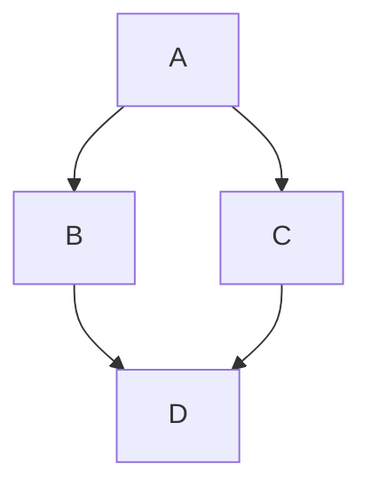

#### Проверка версии русалки
Чтобы гарантировать, что GitHub поддерживает синтаксис русалки, проверьте используемую в настоящее время версию mermaid.

```
  info
```

```mermaid
  info
```
#### Блок-схема
Блок-схемы — распространенный графический способ представления информации. Часто используется для визуализации работы алгоритмов. Блок-схемы обычно состоят из узлов в виде геометрических фигур и стрелок, соединяющих узлы. Mermaid позволяет создавать динамические блок-схемы. 

Блок-схема создается с помощью ключевого слова flowchart и аббревиатуры для указания направления. Имя узла указывается уже на следующей строчке. При этом важно, что нельзя создать узел с именем «end», если очень хочется, то лучше использовать «End» или «END».

```
flowchart TB
	node
```

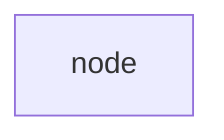

Направление блок-схемы, как уже было отмечено, задается с помощью ключевой аббревиатуры. Всего пользователю доступно 5 аббревиатур:
- TB — «top to bottom», сверху вниз;
- TD — «top-down/ same as top to bottom», сверху вниз;
- BT — «bottom to top», снизу вверх;
- RL — «right to left», справа налево;
- LR — «left to right», слева направо.

##### Узлы
В узел можно поместить любой текст, для этого после имени надо указать текст в квадратных скобках.

```
flowchart TB
  node[Текст в узле]
```

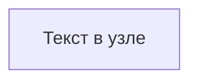

###### Форма
Сами узлы могут быть не только прямоугольными. Форма узла задается символами вокруг текста и доступны следующие геометрические фигуры:

```
flowchart TB
  node1[Форма 1]  
  node2(Форма 2)
  node3([Форма 3])
  node4[[Форма 4]]
  node5[(Форма 5)]
  node6((Форма 6))
  node7>Форма 7]
  node8{Форма 8}
  node9{{Форма 9}}
  node10[/Форма 10/]
  node11[\Форма 11\]
  node12[/Форма 12\]
  node13[\Форма 13/]
```

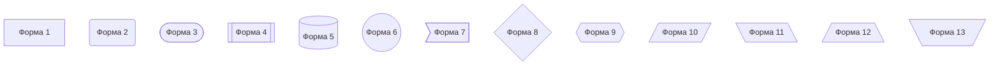

###### Экранирование
Иногда в самом тексте надо разместить специальные символы, которые в процессе рендеринга могут сломать всю конструкцию. Для этих целей доступно экранирование в виде кавычек. Все содержимое в кавычках по умолчанию принимается за текст.

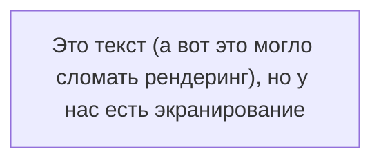

##### Стрелки
Узлы в блок-схеме соединяются с помощью стрелок и линий. В коде они указываются следующим образом:

```
flowchart TB
А --> B
C --- D
E -.-> F
G ==> H
I --o J
K --x L
```

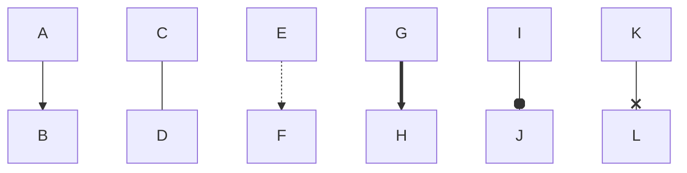

###### Текст
Так же как и в обычной блок-схеме, в Mermaid можно указывать вопрос или размещать текст на стрелках и связях узлов. Для этого достаточно ввести необходимый текст в конструкцию стрелки:

```
flowchart TD
    A-- Text ---B
    C---|Text|D 
    E-->|text|F 
    G-- text -->H 
    I-. text .-> J 
    K == text ==> L
```

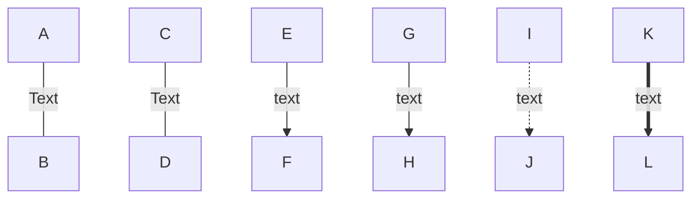

Система рендеринга автоматически подбирает длину стрелок и соединений, но если надо явно задать большую длину, то можно указать большее количество дефисов.

##### Подсхемы
Зачастую на одной блок-схеме необходимо показать взаимосвязанную работу двух алгоритмов. Для этих целей подойдут подсхемы, позволяющие визуально разделять несколько сущностей на одном рисунке. Задаются они следующей конструкцией:

```
subgraph название
    описание графа
end
```

Пример:

```
flowchart TB
    c1-->a2
    subgraph one
    a1-->a2
    end
    subgraph two
    b1-->b2
    end
    subgraph three
    c1-->c2
    end
```

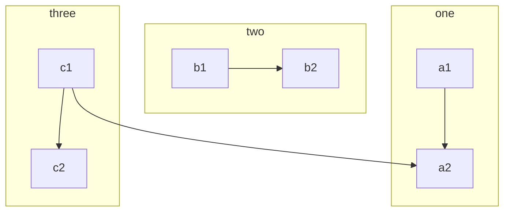

##### Узел-кнопка (не работает в GitHib)
Узел можно сделать кнопкой, открывающей страницу в браузере. Для этого надо указать ссылку в описании узла. Ссылку необходимо экранировать кавычками:

```
flowchart TB
%% создаем узел
    A --> B 
%% Кстати да, комментарии задаются двумя знаками процента
%% Описываем действия для клика по узлу

click A "http://www.github.com"
```

После этого узел A станет кликабельным и по клику будет открываться страница, находящаяся по ссылке. Но проблема в том, что ссылка будет открываться в активной вкладке, что может быть неудобно. Проблему можно решить и указать в конце ссылке ключевое слово _blank.

```
flowchart TB
    A --> B 
    click A "http://www.github.com" _blank
```

**Но это не работает в GitHub из-за ограничений по безопасности, только JavaScript!**

Полное описание:
###### Переход по ссылке (click nodeName "URL")
Вы можете привязать веб-ссылку к узлу.

```
flowchart LR
    A[Нажми на меня] --> B(Google)
    click A "https://google.com"
    click B "https://google.com" _blank "Открыть в новой вкладке"
```

Синтаксис: click узел "URL" [цель] ["всплывающая подсказка"]
- цель (target): необязательный параметр, например _blank для открытия в новой вкладке (по умолчанию _self).
- подсказка: необязательный текст, появляющийся при наведении.
###### Вызов JavaScript-функции
Вы можете вызвать функцию JavaScript, которая должна быть определена на странице, где отображается диаграмма.
```
flowchart LR
    A[Кнопка]
    click A call alert("Узел нажат!")
```
Синтаксис: click узел call функция()

##### Цвета
Узлам можно задавать альтернативные цвета. При этом для каждого отдельно взятого узла можно задать свой цвет. Для этого после описания блок-схемы необходимо написать ключевое слово style, после указать имя узла, а потом описать цветовую схему. Цветовая схема задается с помощью следующих тегов:
- fill — заливка;
- stroke — цвет границы;
- stroke-width — толщина границы;
- color — цвет текста;
- stroke-dasharray — пунктирная граница (аргументы - 2 числа:
	- первое число - длина штриха в пикселях (dash);
	- второе число - длина пробела (gap) между штрихами, тоже в пикселях).

```
flowchart LR
    id1(Start)-->id2(Stop)
    style id1 fill:#3f3,stroke:#333,stroke-width:4px
    style id2 fill:#ff2400,stroke:#333,stroke-width:4px,color:#fff,stroke-dasharray: 12 5
```

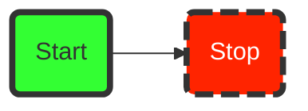

##### Классы стилей
Если блок-схема большая, то может быть неудобно для каждого элемента расписывать его свойства. Для этого есть возможность создавать классы стилей и применять их. Класс объявляется с помощью ключевого слова classDef, далее следует название класса и теги через запятую. Применять стиль можно с помощью трех двоеточий после имени узла (:::).

```
flowchart LR
    classDef class1 fill:#3f3,stroke:#333,stroke-width:4px
    classDef class2 fill:#ff2400,stroke:#333,stroke-width:4px,color:#fff,stroke-dasharray: 12 5
    
    A:::class1 --> B:::class2
```

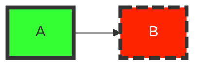

##### Финальный пример
Если применить все полученные знания, то можно построить вот такую несложную блок-схему.

```
flowchart TD
    classDef class1 fill:#7FFFD4, stroke:#000, stroke-width:4px

    A([Нам нужна диаграмма]):::class1
    B{Диаграмма динамическая?}:::class1
    A--->B
    B--Да-->C([Лучше воспользоваться Mermaid.js]):::class1 
    B--Нет-->D([Можно просто нарисовать и вставить с помощью Markdown]):::class1
```

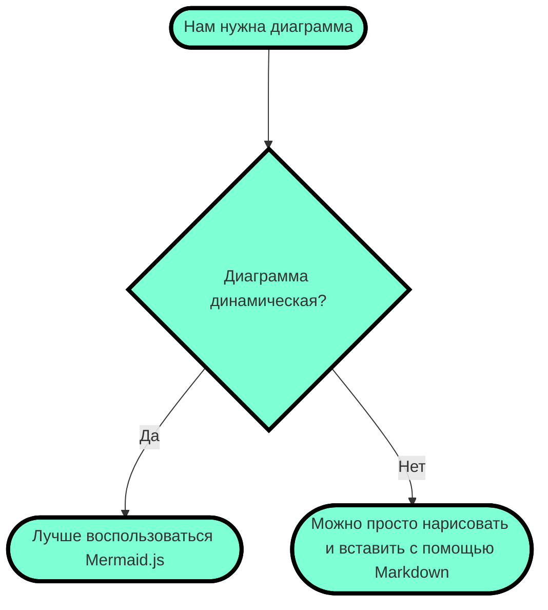

#### Круговые диаграммы
Круговая диаграмма — популярный и простой способ показать какую часть от общего числа занимает отдельные части. В Mermaid круговые диаграммы задаются с помощью ключевого слова pie, далее следует слово title, позволяющее задать название диаграммы и строка с самим названием. Но titlte можно опустить и не использовать, тогда диаграмма будет безымянной.

Данные в диаграмму записываются построчно следующим образом:
- название в кавычках;
- разделитель в виде двоеточия;
- положительное числовое значение (поддерживается до двух знаков после запятой).

```
pie title Продажи легких закусок за декабрь 2021
    "Сендвичи" : 223
    "Салаты" : 50
    "Канапе" : 100
```

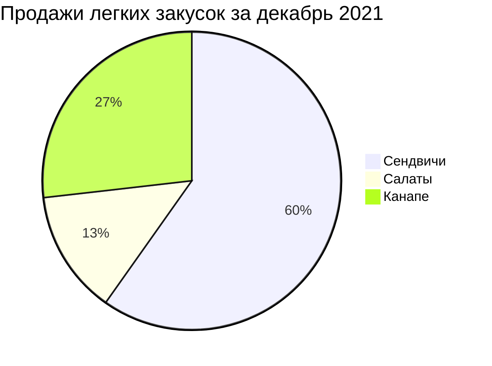

#### Создание трехмерных моделей STL
Синтаксис ASCII STL можно использовать непосредственно в Markdown для создания интерактивных трехмерных моделей. Чтобы отобразить модель, добавьте разметку ASCII STL в блок кода с ограждением, указав идентификатор синтаксиса stl.

Например, можно создать простую трехмерную модель:

```
solid cube_corner
  facet normal 0.0 -1.0 0.0
    outer loop
      vertex 0.0 0.0 0.0
      vertex 1.0 0.0 0.0
      vertex 0.0 0.0 1.0
    endloop
  endfacet
  facet normal 0.0 0.0 -1.0
    outer loop
      vertex 0.0 0.0 0.0
      vertex 0.0 1.0 0.0
      vertex 1.0 0.0 0.0
    endloop
  endfacet
  facet normal -1.0 0.0 0.0
    outer loop
      vertex 0.0 0.0 0.0
      vertex 0.0 0.0 1.0
      vertex 0.0 1.0 0.0
    endloop
  endfacet
  facet normal 0.577 0.577 0.577
    outer loop
      vertex 1.0 0.0 0.0
      vertex 0.0 1.0 0.0
      vertex 0.0 0.0 1.0
    endloop
  endfacet
endsolid
```

```stl
solid cube_corner
  facet normal 0.0 -1.0 0.0
    outer loop
      vertex 0.0 0.0 0.0
      vertex 1.0 0.0 0.0
      vertex 0.0 0.0 1.0
    endloop
  endfacet
  facet normal 0.0 0.0 -1.0
    outer loop
      vertex 0.0 0.0 0.0
      vertex 0.0 1.0 0.0
      vertex 1.0 0.0 0.0
    endloop
  endfacet
  facet normal -1.0 0.0 0.0
    outer loop
      vertex 0.0 0.0 0.0
      vertex 0.0 0.0 1.0
      vertex 0.0 1.0 0.0
    endloop
  endfacet
  facet normal 0.577 0.577 0.577
    outer loop
      vertex 1.0 0.0 0.0
      vertex 0.0 1.0 0.0
      vertex 0.0 0.0 1.0
    endloop
  endfacet
endsolid
```

# Основные конструкции Markdown (шпаргалка):
## Заголовки (Headings): Используйте # перед заголовком. Количество знаков равно уровню заголовка (от 1 до 6).
# Заголовок H1
## Заголовок H2
### Заголовок H3
#### Заголовок H4
##### Заголовок H5
###### Заголовок H6

В синтаксисе Markdown есть шесть уровней заголовков: от H1 (самого большого) до H6 (самого маленького). Для их выделения используют решётки #, при этом есть несколько тонкостей:

Решётки можно ставить как перед заголовком, так и с двух сторон от него (на уровень заголовка влияют только те #, которые находятся перед ним);
количество решёток соответствует уровню заголовка: одна для первого уровня, две для второго и так далее;
между решёткой и текстом ставится пробел.
## Заголовок второго уровня с # с двух сторон ##
#### Заголовок четвёртого уровня с # с двух сторон #
##### Заголовок пятого уровня  с # с двух сторон ############

У заголовков первого и второго уровня есть альтернативный способ выделения: на следующей строке после них нужно поставить знаки равенства = или дефисы -. Вот несколько правил:

- знак = применяется для заголовков H1;
- дефис применяется для заголовков H2;
- если в одной строке поставить оба знака, то работать ничего не будет;
- можно ставить любое количество знаков, и на тип заголовка это не повлияет;
- между заголовком и знаками не должно быть пустых строк.

Заголовок первого уровня
=
Заголовок первого уровня
=========
Заголовок второго уровня
-
Заголовок второго уровня
----------
Не заголовок
= -

## Параграфы и разрывы строк (paragraphs and line breaks):
Чтобы поделить текст на параграфы, между ними нужно оставить пустую строку. Строка считается пустой, даже если в ней есть пробелы и табуляции. Если же строки находятся рядом, то они автоматически склеиваются в одну.

Первый параграф

Второй параграф
Продолжение второго параграфа

### Для переноса строки внутри одного параграфа есть три метода:
- поставить в конце строки два или больше пробела   ;
- поставить в конце строки обратную косую черту \;
- использовать HTML-тег \<br>.

Перенос с помощью пробелов  
продолжение параграфа после переноса.

Перенос с помощью обратного слеша\
продолжение параграфа после переноса.

Перенос с помощью тега <br> продолжение параграфа после переноса.

## Диалекты
Простой Markdown не всегда подходит для тех или иных проектов, поэтому существуют спецификации, которые расширяют или сужают его.

### GitHub Flavored Markdown
GFM — один из диалектов Markdown, который, как можно догадаться из названия, используется на GitHub. Он основан на спецификации CommonMark и расширяет её дополнительными элементами: таблицами, списками задач и зачёркиваниями.

## Выделение текста (Emphasis):
### Курсив (italic):
\*текст* или \_текст_ &rarr; *текст* или _текст_.

### Жирный (bold):
\*\*текст\*\* или \_\_текст__ &rarr; **текст** или __текст__. Обратите внимание, что если вы хотите выделить фрагмент внутри слова, то это корректно сработает только при использовании звёздочек.
Кор*рек*тно, кор**рек**тно, кор***рек***тно
Некор_рек_тно, некор__рек__тно, некор___рек___тно

### Жирный курсив (bold and italic):
\*\*\*текст\*\*\* или \_\_\_текст___ &rarr; ***текст*** или ___текст___.

### Зачеркнутый (strikethrough):
\~\~текст~~ &rarr; ~~текст~~.

### Подчёркнутый (underline):
В синтаксисе Markdown нет встроенного способа подчеркнуть текст. Но если ваш редактор поддерживает HTML, то можно использовать теги:

\<u>Подчёркнутый текст\</u> &rarr; <u>Подчёркнутый текст</u>

### Нижний индекс (Subscript - Lower index - Inferior index):
В Markdown одна тильда (\~) с двух сторон от текста (\~текст~) обычно используется для подстрочного (нижнего) индекса в расширенном синтаксисе.\
Пример: H\~2\~O превратится в H~2~O.

## Разделитель (Horizontal Rule):
Чтобы оформить горизонтальный разделитель, нужно поставить три или больше специальных символа: звёздочки \*, дефиса - или нижних подчёркивания _. Они должны находиться на отдельной строке, и между ними можно ставить любое количество пробелов и табуляций.

Если ваш редактор поддерживает HTML-теги, то для разметки можно также использовать тег \<hr>.

\***
***
\---
---
\___
___

\*	*  **
*	*  **
\<hr>
<hr>

## Цитаты (Blockquotes):
Чтобы параграф отобразился как цитата, нужно поставить перед ним закрывающую угловую скобку >.

> Оформление цитатой
последовательных строк
внутри одного параграфа

Внутрь одного блока цитаты можно поместить сразу несколько параграфов и использовать любые элементы оформления. Например, заголовки и другие цитаты. Чтобы сделать это, нужно поместить закрывающую угловую скобку перед началом каждой строки.

> # Заголовок
> Первый параграф
>
> Второй параграф
>
> > Вложенная цитата
> > > Цитата третьего уровня
>
> Продолжение основной цитаты


## Списки (Lists):
В синтаксисе Markdown есть несколько видов списков. Для их оформления перед каждым пунктом нужно поставить подходящий тег и отделить его от текста пробелом.

### Нумерованные (ordered):
Для создания нумерованного списка перед пунктами нужно поставить число с точкой. При этом нумерация в разметке ленивая. Неважно, какие именно числа вы напишете: Markdown пронумерует список автоматически.
1. "1." Первый пункт
2. "2." Второй пункт
3. "3." Третий пункт

<p>&nbsp;</p>

1. "1." Первый пункт
1. "1." Второй пункт
1. "1." Третий пункт

<p>&nbsp;</p>

1.  "1."  Первый пункт
73. "73." Второй пункт
5.  "5."  Третий пункт

Список можно начинать и не с единицы. Для нумерации важно только число, которое стоит перед первым пунктом.

27. "27." Первый пункт
27. "27." Второй пункт
27. "27." Третий пункт

Обратите внимание, что между двумя нумерованными списками, идущими подряд, нужно отбить две пустые строки. Если отбить только одну, то Markdown воспримет два списка как один. Некоторые редакторы в таком случае увеличивают интервал между пунктами.
1. "1." Первый пункт
2. "2." Второй пункт
3. "3." Третий пункт

1. "1." Четвёртый пункт
2. "2." Пятый пункт
3. "3." Шестой пункт

### Ненумерованные (unordered)
Для создания ненумерованного списка нужно поставить перед каждым пунктом звёздочку \*, дефис - или плюс +.

* "*" Первый пункт
* "*" Второй пункт
* "*" Третий пункт

<p>&nbsp;</p>

- "-" Первый пункт
- "-" Второй пункт
- "-" Третий пункт

<p>&nbsp;</p>

+ "+" Первый пункт
+ "+" Второй пункт
+ "+" Третий пункт

Обратите внимание, что Markdown относит к разным спискам пункты, перед которыми стоят разные маркеры. Даже несмотря на то, что мы не оставляем пустых строк между списками.

Если же два списка идут подряд, а перед их пунктами стоят одинаковые маркеры, тогда между ними нужно отбить две пустые строки (как в случае с нумерованными списками).

### Чекбоксы (Task Lists):
Чтобы сделать чекбоксы, нужно использовать маркированный список, но между маркером и текстом поставить [x] для отмеченного пункта и [] — для неотмеченного.

Чекбоксы доступны в диалекте GitHub Flavored Markdown (тот самый, который умеет зачёркивать текст) и поддерживаются не всеми редакторами Markdown.

- [x] Отмеченный пункт
- [ ] Неотмеченный пункт

### Вложенные (nested)
Чтобы создать вложенный список, нужно поставить перед его пунктами табуляцию или несколько пробелов. В Markdown одна табуляция соответствует четырём пробелам.

Список одного вида можно вкладывать в любой другой.

1. Пункт
	1. Подпункт
		1. Подподпункт

- Пункт
	- Подпункт
		- Подподпункт


1. Пункт
	- Подпункт
		* Подподпункт

+ Пункт
	1. Подпункт

- Пункт
  - [x] Отмеченный подпункт
  - [ ] Неотмеченный подпункт
    1. Подподпункт

### Другие элементы внутри списков
В пункты списков можно добавлять другие элементы оформления. Например, параграфы или цитаты. Для этого нужно сделать отступ, как если бы вы добавляли вложенный список.

1. Первый пункт
	> Цитата внутри первого пункта
1. Второй пункт
	
    Параграф внутри второго пункта
1. Третий пункт

## Ссылки (Links):
Самый лёгкий способ поместить ссылку в Markdown — заключить её в угловые скобки. Несмотря на простоту, он не является основным и был добавлен только в спецификации CommonMark.

<https://skillbox.ru/media/code/>

Чтобы оформить ссылкой часть текста, используется такой синтаксис: \[текст](ссылка). Можно сделать всплывающую подсказку при наведении курсора. Для этого в круглых скобках после ссылки нужно поставить пробел и написать текст подсказки в кавычках.

[Skillbox Media](https://skillbox.ru/media/) без подсказки

[Skillbox Media](https://skillbox.ru/media/ "Всплывающая подсказка") с подсказкой

Ещё один способ оформить ссылку — справочный. Он работает как сноски в книгах: \[текст]\[имя сноски]. При таком способе организации ссылок в конце документа нужно также написать и оформить саму сноску: \[имя сноски]: ссылка. При желании после ссылки можно добавить подсказку — точно так же, как в предыдущем методе.

Имя сноски может быть любым сочетанием символов: цифрами, буквами и даже знаками препинания. На одну и ту же сноску в тексте можно ссылаться сколько угодно раз.

Ссылки, оформленные справочным методом, выглядят и работают точно так же, как и в предыдущем способе. Сами сноски в отформатированном документе не отображаются.

[Skillbox Media][1]

[Раздел «Код»][code]


[1]: https://skillbox.ru/media "Всплывающая подсказка"
[code]: https://skillbox.ru/media/code/

## Изображения (Images):
### Базовый синтаксис
Изображения в Markdown оформляются по принципу, схожему с принципом оформления ссылкок, только перед квадратными скобками нужно поставить восклицательный знак: !\[текст](путь к изображению). Здесь также можно сделать всплывающую подсказку.


### Cправочный метод
Можно использовать и справочный метод: ![текст][имя сноски]. Сноски оформляются так же, как и в ссылках: [имя сноски]: путь к изображению, — в них тоже можно добавлять подсказки.

![Изображение][2]


[2]: https://upload.wikimedia.org/wikipedia/commons/thumb/4/48/Markdown-mark.svg/1920px-Markdown-mark.svg.png "Логотип Markdown"
Такая разметка выведет тот же результат, что и предыдущая.

### Ссылка-картинка
Чтобы сделать изображение кликабельным (ссылкой), оберните его в квадратные скобки и добавьте ссылку в круглых \[\!\[Alt Text](ImageURL)](DestinationURL)

[](https://upload.wikimedia.org/wikipedia/commons/thumb/4/48/Markdown-mark.svg/1920px-Markdown-mark.svg.png)

## Код (Code):
В Markdown есть несколько способов выделить исходный код:

Если надо отобразить фрагмент кода внутри строки с каким-то текстом, нужно с двух сторон выделить этот код одним или несколькими обратными построфами (`; их ещё называют бэктиками).`

Чтобы выделить фрагмент из нескольких строк, нужно с двух сторон выделить его тремя обратными апострофами.
Также перед фрагментом кода можно поставить табуляцию или четыре пробела, при этом предыдущая строка должна быть пустой.
Функция `print (x)` выводит содержимое переменной ```x```.

```
#include <stdio.h>
int main() {
   printf("Hello, World!");
   return 0;
}
```

	let x = 12;
	let y = 6;
	console.log(x + y);

Если обрамлять код тремя обратными апострофами, то после первой тройки можно указать язык программирования — тогда Markdown правильно подсветит элементы кода.

Python:
```python
if x > 0:
	print (x)
else:
	print ('Hello, World!')
```

C:
```c
#include <stdio.h>
int main() {
   printf("Hello, World!");
   return 0;
}
```

JavaScript:
```javascript
let x = 12;
let y = 6;
console.log(x + y);
```

Возможность вставлять блоки кода тремя обратными апострофами появилась в спецификации CommonMark, но там не указан список псевдонимов: как правильно называть языки, чтобы Markdown понял, о чём речь.

Поэтому каждая реализация ведёт свой собственный список языков и их псевдонимов. Так как их очень много, да ещё и новые время от времени добавляются, то удобных таблиц обычно не делают. Предлагают сразу ознакомиться с конфигурационным файлом.

Вот такой список языков, например, поддерживает диалект GitHub Flavored Markdown.

## Таблицы (Tables): (Расширение Markdown, поддерживается GitHub и др.).
В уже упомянутом выше диалекте GitHub Flavored Markdown (и некоторых других тоже) есть возможность оформлять таблицы. Столбцы разделяются вертикальными линиями |, а строка с шапкой отделяется от остальных дефисами -, которых можно ставить сколько угодно.

|Столбец 1|Столбец 2|Столбец 3|
|-|--------|---|
|Длинная запись в первом столбце|Запись в столбце 2|Запись в столбце 3|
|Кртк зпс| |Слева нет записи|

Чтобы выровнять весь столбец по правому краю, в строке с дефисами сразу после дефисов можно поставить двоеточие :. Чтобы выровнять содержимое по центру, надо поставить двоеточия с обеих сторон.

|Столбец 1|Столбец 2|Столбец 3|
|:-|:-:|-:|
|Равнение по левому краю|Равнение по центру|Равнение по правому краю|
|Запись|Запись|Запись|

## Дополнительные возможности:
### HTML
Можно вставлять элементы HTML, такие как \<u> или \<div>, если стандартного синтаксиса недостаточно.
<p>Старая цена: <s>1000 руб.</s></p>
<p>Новая цена: 500 руб.</p>

### Экранирование (escaping characters)
Многие символы в Markdown выполняют роль служебных. Если они встречаются в вашем тексте сами по себе, то для корректного отображения их стоит экранировать (иначе они просто не только не отобразятся сами, но и добавят вашему тексту какое-нибудь ненужное форматирование). Для этого перед ними ставится обратная косая черта \\.

Вот список символов, которые нужно экранировать: \\`*_{}[]<>()#+-.! |.
Делать это постоянно необязательно — достаточно ставить экран только в тех случаях, когда Markdown может воспринять эти символы как служебные. Например, если строка начинается с символа #, то экранировать её надо — потому что программа может решить, что вы хотите сделать заголовок. А вот если решётка находится где-то в центре строки, то экранировать ничего не надо — редактор поймёт, что тут она просто часть текста.

### Выделение цветом
В стандартном Markdown нет встроенной поддержки цвета, но его можно выделить, используя HTML-теги или специальные расширения (в Obsidian, Yandex DataLens). Основные способы: <span style="color:red">текст</span> (HTML-цвет), ==текст== (подсветка маркером) или специализированные конструкции. 

Вот основные варианты выделения цветом:
1. Использование HTML (работает почти везде):\
Большинство Markdown-обработчиков поддерживают HTML-теги.
Цветной текст: \<span style="color: #ff0000;">Красный текст\</span> &rarr; <span style="color: #ff0000;">Красный текст</span>.
Использование названий цветов: \<span style="color: blue;">Синий текст\</span> &rarr; <span style="color: blue;">Синий текст</span>. 
2. Подсветка маркером (Highlight):\
Многие редакторы (Obsidian, Logseq, GitHub) поддерживают синтаксис выделения фона текста.
\==текст с подсветкой== &rarr; ==текст с подсветкой==.
3. Специфические расширения (DataLens, Gramax):\
Некоторые системы поддерживают собственный синтаксис для цвета:\
Yandex DataLens: {red}(текст) &rarr; текст.\
Gramax: [color:#FF0000]текст[/color] &rarr; text.

Важно: Использование цветов может перегрузить документ, поэтому рекомендуется использовать их сдержанно. 

### Stack Exchange Additions
Популярный среди разработчиков сайт Stack Overflow и все остальные сайты, входящие в группу Stack Exchange, используют в редакторе вопросов Markdown, основанный на спецификации CommonMark. Он расширен следующим образом:

#### Теги
Ссылка на вопросы по определённому тегу пишется просто в квадратных скобках с префиксом tag:

Все вопросы по тегу \[tag:javascript] &rarr; [tag:javascript] на нашем сайте.

### Спойлер
Если после символа цитирования поставить восклицательный знак (>!), то цитата выведется свёрнутой, и развернуть её пользователь сможет, кликнув по ней.

В конце пятого эпизода выясняется, что

\>! он его отец &darr;.
>! он его отец.

### Использование Markdown в мессенджерах
Как мы уже писали, принципы Markdown используются при разметке текста во многих мессенджерах. Обычно он используется для выделения текста, при этом синтаксис у каждой платформы свой.

**Жирный:**
- Telegram и Discord — \*\*две звёздочки с двух сторон\*\*;
- WhatsApp и Viber — \*одна звёздочка с двух сторон\*.

*Курсив:*
- Telegram — \_\_два нижних подчёркивания с двух сторон__;
- WhatsApp и Viber — \_одно нижнее подчёркивание с двух сторон_;
- Discord — \*одна звёздочка с двух сторон\* или \_одно нижнее подчёркивание с двух сторон_.

<u>Подчёркнутый</u>:
- Discord — \_\_два нижних подчёркивания с двух сторон__.

~~Зачёркнутый:~~
- WhatsApp и Viber — \~одна тильда с двух сторон\~;
- Discord — \~\~две тильды с двух сторон~~.

`Моноширинный (используется для вставки кода):`
- Telegram, WhatsApp, Viber и Discord — \`\`\`три обратных апострофа с двух сторон\`\`\`; в Discord точно так же, как и в Markdown, можно указывать язык программирования для подсветки синтаксиса.

Спойлер:
- Telegram и Discord — ||две вертикальные черты с двух сторон||.

### Видео Youtube
Ролики нельзя вставить напрямую, но можно вставить изображение со ссылкой на видео, например:

<a href="http://www.youtube.com/watch?feature=player_embedded&v=ID_ВИДЕОРОЛИКА_НА_YOUTUBE" target="_blank"></a>

На чистом Markdown, но без размеров изображения и рамки:

[](http://www.youtube.com/watch?v=ID_ВИДЕОРОЛИКА_НА_YOUTUBE)

### Эмодзи
||People||
|---|---|---|
| :bowtie: `:bowtie:` | :smile: `:smile:` | :laughing: `:laughing:` |
| :blush: `:blush:` | :smiley: `:smiley:` | :relaxed: `:relaxed:` |
| :smirk: `:smirk:` | :heart_eyes: `:heart_eyes:` | :kissing_heart: `:kissing_heart:` |
| :kissing_closed_eyes: `:kissing_closed_eyes:` | :flushed: `:flushed:` | :relieved: `:relieved:` |
| :satisfied: `:satisfied:` | :grin: `:grin:` | :wink: `:wink:` |
| :stuck_out_tongue_winking_eye: `:stuck_out_tongue_winking_eye:` | :stuck_out_tongue_closed_eyes: `:stuck_out_tongue_closed_eyes:` | :grinning: `:grinning:` |
| :kissing: `:kissing:` | :kissing_smiling_eyes: `:kissing_smiling_eyes:` | :stuck_out_tongue: `:stuck_out_tongue:` |
| :sleeping: `:sleeping:` | :worried: `:worried:` | :frowning: `:frowning:` |
| :anguished: `:anguished:` | :open_mouth: `:open_mouth:` | :grimacing: `:grimacing:` |
| :confused: `:confused:` | :hushed: `:hushed:` | :expressionless: `:expressionless:` |
| :unamused: `:unamused:` | :sweat_smile: `:sweat_smile:` | :sweat: `:sweat:` |
| :disappointed_relieved: `:disappointed_relieved:` | :weary: `:weary:` | :pensive: `:pensive:` |
| :disappointed: `:disappointed:` | :confounded: `:confounded:` | :fearful: `:fearful:` |
| :cold_sweat: `:cold_sweat:` | :persevere: `:persevere:` | :cry: `:cry:` |
| :sob: `:sob:` | :joy: `:joy:` | :astonished: `:astonished:` |
| :scream: `:scream:` | :neckbeard: `:neckbeard:` | :tired_face: `:tired_face:` |
| :angry: `:angry:` | :rage: `:rage:` | :triumph: `:triumph:` |
| :sleepy: `:sleepy:` | :yum: `:yum:` | :mask: `:mask:` |
| :sunglasses: `:sunglasses:` | :dizzy_face: `:dizzy_face:` | :imp: `:imp:` |
| :smiling_imp: `:smiling_imp:` | :neutral_face: `:neutral_face:` | :no_mouth: `:no_mouth:` |
| :innocent: `:innocent:` | :alien: `:alien:` | :yellow_heart: `:yellow_heart:` |
| :blue_heart: `:blue_heart:` | :purple_heart: `:purple_heart:` | :heart: `:heart:` |
| :green_heart: `:green_heart:` | :broken_heart: `:broken_heart:` | :heartbeat: `:heartbeat:` |
| :heartpulse: `:heartpulse:` | :two_hearts: `:two_hearts:` | :revolving_hearts: `:revolving_hearts:` |
| :cupid: `:cupid:` | :sparkling_heart: `:sparkling_heart:` | :sparkles: `:sparkles:` |
| :star: `:star:` | :star2: `:star2:` | :dizzy: `:dizzy:` |
| :boom: `:boom:` | :collision: `:collision:` | :anger: `:anger:` |
| :exclamation: `:exclamation:` | :question: `:question:` | :grey_exclamation: `:grey_exclamation:` |
| :grey_question: `:grey_question:` | :zzz: `:zzz:` | :dash: `:dash:` |
| :sweat_drops: `:sweat_drops:` | :notes: `:notes:` | :musical_note: `:musical_note:` |
| :fire: `:fire:` | :hankey: `:hankey:` | :poop: `:poop:` |
| :shit: `:shit:` | :+1: `:+1:` | :thumbsup: `:thumbsup:` |
| :-1: `:-1:` | :thumbsdown: `:thumbsdown:` | :ok_hand: `:ok_hand:` |
| :punch: `:punch:` | :facepunch: `:facepunch:` | :fist: `:fist:` |
| :v: `:v:` | :wave: `:wave:` | :hand: `:hand:` |
| :raised_hand: `:raised_hand:` | :open_hands: `:open_hands:` | :point_up: `:point_up:` |
| :point_down: `:point_down:` | :point_left: `:point_left:` | :point_right: `:point_right:` |
| :raised_hands: `:raised_hands:` | :pray: `:pray:` | :point_up_2: `:point_up_2:` |
| :clap: `:clap:` | :muscle: `:muscle:` | :metal: `:metal:` |
| :fu: `:fu:` | :walking: `:walking:` | :runner: `:runner:` |
| :running: `:running:` | :couple: `:couple:` | :family: `:family:` |
| :two_men_holding_hands: `:two_men_holding_hands:` | :two_women_holding_hands: `:two_women_holding_hands:` | :dancer: `:dancer:` |
| :dancers: `:dancers:` | :ok_woman: `:ok_woman:` | :no_good: `:no_good:` |
| :information_desk_person: `:information_desk_person:` | :raising_hand: `:raising_hand:` | :bride_with_veil: `:bride_with_veil:` |
| :person_with_pouting_face: `:person_with_pouting_face:` | :person_frowning: `:person_frowning:` | :bow: `:bow:` |
| :couplekiss: `:couplekiss:` | :couple_with_heart: `:couple_with_heart:` | :massage: `:massage:` |
| :haircut: `:haircut:` | :nail_care: `:nail_care:` | :boy: `:boy:` |
| :girl: `:girl:` | :woman: `:woman:` | :man: `:man:` |
| :baby: `:baby:` | :older_woman: `:older_woman:` | :older_man: `:older_man:` |
| :person_with_blond_hair: `:person_with_blond_hair:` | :man_with_gua_pi_mao: `:man_with_gua_pi_mao:` | :man_with_turban: `:man_with_turban:` |
| :construction_worker: `:construction_worker:` | :cop: `:cop:` | :angel: `:angel:` |
| :princess: `:princess:` | :smiley_cat: `:smiley_cat:` | :smile_cat: `:smile_cat:` |
| :heart_eyes_cat: `:heart_eyes_cat:` | :kissing_cat: `:kissing_cat:` | :smirk_cat: `:smirk_cat:` |
| :scream_cat: `:scream_cat:` | :crying_cat_face: `:crying_cat_face:` | :joy_cat: `:joy_cat:` |
| :pouting_cat: `:pouting_cat:` | :japanese_ogre: `:japanese_ogre:` | :japanese_goblin: `:japanese_goblin:` |
| :see_no_evil: `:see_no_evil:` | :hear_no_evil: `:hear_no_evil:` | :speak_no_evil: `:speak_no_evil:` |
| :guardsman: `:guardsman:` | :skull: `:skull:` | :feet: `:feet:` |
| :lips: `:lips:` | :kiss: `:kiss:` | :droplet: `:droplet:` |
| :ear: `:ear:` | :eyes: `:eyes:` | :nose: `:nose:` |
| :tongue: `:tongue:` | :love_letter: `:love_letter:` | :bust_in_silhouette: `:bust_in_silhouette:` |
| :busts_in_silhouette: `:busts_in_silhouette:` | :speech_balloon: `:speech_balloon:` | :thought_balloon: `:thought_balloon:` |
| :feelsgood: `:feelsgood:` | :finnadie: `:finnadie:` | :goberserk: `:goberserk:` |
| :godmode: `:godmode:` | :hurtrealbad: `:hurtrealbad:` | :rage1: `:rage1:` |
| :rage2: `:rage2:` | :rage3: `:rage3:` | :rage4: `:rage4:` |
| :suspect: `:suspect:` | :trollface: `:trollface:` | 

||Nature||
|---|---|---|
| :sunny: `:sunny:` | :umbrella: `:umbrella:` | :cloud: `:cloud:` |
| :snowflake: `:snowflake:` | :snowman: `:snowman:` | :zap: `:zap:` |
| :cyclone: `:cyclone:` | :foggy: `:foggy:` | :ocean: `:ocean:` |
| :cat: `:cat:` | :dog: `:dog:` | :mouse: `:mouse:` |
| :hamster: `:hamster:` | :rabbit: `:rabbit:` | :wolf: `:wolf:` |
| :frog: `:frog:` | :tiger: `:tiger:` | :koala: `:koala:` |
| :bear: `:bear:` | :pig: `:pig:` | :pig_nose: `:pig_nose:` |
| :cow: `:cow:` | :boar: `:boar:` | :monkey_face: `:monkey_face:` |
| :monkey: `:monkey:` | :horse: `:horse:` | :racehorse: `:racehorse:` |
| :camel: `:camel:` | :sheep: `:sheep:` | :elephant: `:elephant:` |
| :panda_face: `:panda_face:` | :snake: `:snake:` | :bird: `:bird:` |
| :baby_chick: `:baby_chick:` | :hatched_chick: `:hatched_chick:` | :hatching_chick: `:hatching_chick:` |
| :chicken: `:chicken:` | :penguin: `:penguin:` | :turtle: `:turtle:` |
| :bug: `:bug:` | :honeybee: `:honeybee:` | :ant: `:ant:` |
| :beetle: `:beetle:` | :snail: `:snail:` | :octopus: `:octopus:` |
| :tropical_fish: `:tropical_fish:` | :fish: `:fish:` | :whale: `:whale:` |
| :whale2: `:whale2:` | :dolphin: `:dolphin:` | :cow2: `:cow2:` |
| :ram: `:ram:` | :rat: `:rat:` | :water_buffalo: `:water_buffalo:` |
| :tiger2: `:tiger2:` | :rabbit2: `:rabbit2:` | :dragon: `:dragon:` |
| :goat: `:goat:` | :rooster: `:rooster:` | :dog2: `:dog2:` |
| :pig2: `:pig2:` | :mouse2: `:mouse2:` | :ox: `:ox:` |
| :dragon_face: `:dragon_face:` | :blowfish: `:blowfish:` | :crocodile: `:crocodile:` |
| :dromedary_camel: `:dromedary_camel:` | :leopard: `:leopard:` | :cat2: `:cat2:` |
| :poodle: `:poodle:` | :paw_prints: `:paw_prints:` | :bouquet: `:bouquet:` |
| :cherry_blossom: `:cherry_blossom:` | :tulip: `:tulip:` | :four_leaf_clover: `:four_leaf_clover:` |
| :rose: `:rose:` | :sunflower: `:sunflower:` | :hibiscus: `:hibiscus:` |
| :maple_leaf: `:maple_leaf:` | :leaves: `:leaves:` | :fallen_leaf: `:fallen_leaf:` |
| :herb: `:herb:` | :mushroom: `:mushroom:` | :cactus: `:cactus:` |
| :palm_tree: `:palm_tree:` | :evergreen_tree: `:evergreen_tree:` | :deciduous_tree: `:deciduous_tree:` |
| :chestnut: `:chestnut:` | :seedling: `:seedling:` | :blossom: `:blossom:` |
| :ear_of_rice: `:ear_of_rice:` | :shell: `:shell:` | :globe_with_meridians: `:globe_with_meridians:` |
| :sun_with_face: `:sun_with_face:` | :full_moon_with_face: `:full_moon_with_face:` | :new_moon_with_face: `:new_moon_with_face:` |
| :new_moon: `:new_moon:` | :waxing_crescent_moon: `:waxing_crescent_moon:` | :first_quarter_moon: `:first_quarter_moon:` |
| :waxing_gibbous_moon: `:waxing_gibbous_moon:` | :full_moon: `:full_moon:` | :waning_gibbous_moon: `:waning_gibbous_moon:` |
| :last_quarter_moon: `:last_quarter_moon:` | :waning_crescent_moon: `:waning_crescent_moon:` | :last_quarter_moon_with_face: `:last_quarter_moon_with_face:` |
| :first_quarter_moon_with_face: `:first_quarter_moon_with_face:` | :moon: `:moon:` | :earth_africa: `:earth_africa:` |
| :earth_americas: `:earth_americas:` | :earth_asia: `:earth_asia:` | :volcano: `:volcano:` |
| :milky_way: `:milky_way:` | :partly_sunny: `:partly_sunny:` | :octocat: `:octocat:` |
| :squirrel: `:squirrel:` |

||Objects||
|---|---|---|
| :bamboo: `:bamboo:` | :gift_heart: `:gift_heart:` | :dolls: `:dolls:` |
| :school_satchel: `:school_satchel:` | :mortar_board: `:mortar_board:` | :flags: `:flags:` |
| :fireworks: `:fireworks:` | :sparkler: `:sparkler:` | :wind_chime: `:wind_chime:` |
| :rice_scene: `:rice_scene:` | :jack_o_lantern: `:jack_o_lantern:` | :ghost: `:ghost:` |
| :santa: `:santa:` | :christmas_tree: `:christmas_tree:` | :gift: `:gift:` |
| :bell: `:bell:` | :no_bell: `:no_bell:` | :tanabata_tree: `:tanabata_tree:` |
| :tada: `:tada:` | :confetti_ball: `:confetti_ball:` | :balloon: `:balloon:` |
| :crystal_ball: `:crystal_ball:` | :cd: `:cd:` | :dvd: `:dvd:` |
| :floppy_disk: `:floppy_disk:` | :camera: `:camera:` | :video_camera: `:video_camera:` |
| :movie_camera: `:movie_camera:` | :computer: `:computer:` | :tv: `:tv:` |
| :iphone: `:iphone:` | :phone: `:phone:` | :telephone: `:telephone:` |
| :telephone_receiver: `:telephone_receiver:` | :pager: `:pager:` | :fax: `:fax:` |
| :minidisc: `:minidisc:` | :vhs: `:vhs:` | :sound: `:sound:` |
| :speaker: `:speaker:` | :mute: `:mute:` | :loudspeaker: `:loudspeaker:` |
| :mega: `:mega:` | :hourglass: `:hourglass:` | :hourglass_flowing_sand: `:hourglass_flowing_sand:` |
| :alarm_clock: `:alarm_clock:` | :watch: `:watch:` | :radio: `:radio:` |
| :satellite: `:satellite:` | :loop: `:loop:` | :mag: `:mag:` |
| :mag_right: `:mag_right:` | :unlock: `:unlock:` | :lock: `:lock:` |
| :lock_with_ink_pen: `:lock_with_ink_pen:` | :closed_lock_with_key: `:closed_lock_with_key:` | :key: `:key:` |
| :bulb: `:bulb:` | :flashlight: `:flashlight:` | :high_brightness: `:high_brightness:` |
| :low_brightness: `:low_brightness:` | :electric_plug: `:electric_plug:` | :battery: `:battery:` |
| :calling: `:calling:` | :email: `:email:` | :mailbox: `:mailbox:` |
| :postbox: `:postbox:` | :bath: `:bath:` | :bathtub: `:bathtub:` |
| :shower: `:shower:` | :toilet: `:toilet:` | :wrench: `:wrench:` |
| :nut_and_bolt: `:nut_and_bolt:` | :hammer: `:hammer:` | :seat: `:seat:` |
| :moneybag: `:moneybag:` | :yen: `:yen:` | :dollar: `:dollar:` |
| :pound: `:pound:` | :euro: `:euro:` | :credit_card: `:credit_card:` |
| :money_with_wings: `:money_with_wings:` | :e-mail: `:e-mail:` | :inbox_tray: `:inbox_tray:` |
| :outbox_tray: `:outbox_tray:` | :envelope: `:envelope:` | :incoming_envelope: `:incoming_envelope:` |
| :postal_horn: `:postal_horn:` | :mailbox_closed: `:mailbox_closed:` | :mailbox_with_mail: `:mailbox_with_mail:` |
| :mailbox_with_no_mail: `:mailbox_with_no_mail:` | :door: `:door:` | :smoking: `:smoking:` |
| :bomb: `:bomb:` | :gun: `:gun:` | :hocho: `:hocho:` |
| :pill: `:pill:` | :syringe: `:syringe:` | :page_facing_up: `:page_facing_up:` |
| :page_with_curl: `:page_with_curl:` | :bookmark_tabs: `:bookmark_tabs:` | :bar_chart: `:bar_chart:` |
| :chart_with_upwards_trend: `:chart_with_upwards_trend:` | :chart_with_downwards_trend: `:chart_with_downwards_trend:` | :scroll: `:scroll:` |
| :clipboard: `:clipboard:` | :calendar: `:calendar:` | :date: `:date:` |
| :card_index: `:card_index:` | :file_folder: `:file_folder:` | :open_file_folder: `:open_file_folder:` |
| :scissors: `:scissors:` | :pushpin: `:pushpin:` | :paperclip: `:paperclip:` |
| :black_nib: `:black_nib:` | :pencil2: `:pencil2:` | :straight_ruler: `:straight_ruler:` |
| :triangular_ruler: `:triangular_ruler:` | :closed_book: `:closed_book:` | :green_book: `:green_book:` |
| :blue_book: `:blue_book:` | :orange_book: `:orange_book:` | :notebook: `:notebook:` |
| :notebook_with_decorative_cover: `:notebook_with_decorative_cover:` | :ledger: `:ledger:` | :books: `:books:` |
| :bookmark: `:bookmark:` | :name_badge: `:name_badge:` | :microscope: `:microscope:` |
| :telescope: `:telescope:` | :newspaper: `:newspaper:` | :football: `:football:` |
| :basketball: `:basketball:` | :soccer: `:soccer:` | :baseball: `:baseball:` |
| :tennis: `:tennis:` | :8ball: `:8ball:` | :rugby_football: `:rugby_football:` |
| :bowling: `:bowling:` | :golf: `:golf:` | :mountain_bicyclist: `:mountain_bicyclist:` |
| :bicyclist: `:bicyclist:` | :horse_racing: `:horse_racing:` | :snowboarder: `:snowboarder:` |
| :swimmer: `:swimmer:` | :surfer: `:surfer:` | :ski: `:ski:` |
| :spades: `:spades:` | :hearts: `:hearts:` | :clubs: `:clubs:` |
| :diamonds: `:diamonds:` | :gem: `:gem:` | :ring: `:ring:` |
| :trophy: `:trophy:` | :musical_score: `:musical_score:` | :musical_keyboard: `:musical_keyboard:` |
| :violin: `:violin:` | :space_invader: `:space_invader:` | :video_game: `:video_game:` |
| :black_joker: `:black_joker:` | :flower_playing_cards: `:flower_playing_cards:` | :game_die: `:game_die:` |
| :dart: `:dart:` | :mahjong: `:mahjong:` | :clapper: `:clapper:` |
| :memo: `:memo:` | :pencil: `:pencil:` | :book: `:book:` |
| :art: `:art:` | :microphone: `:microphone:` | :headphones: `:headphones:` |
| :trumpet: `:trumpet:` | :saxophone: `:saxophone:` | :guitar: `:guitar:` |
| :shoe: `:shoe:` | :sandal: `:sandal:` | :high_heel: `:high_heel:` |
| :lipstick: `:lipstick:` | :boot: `:boot:` | :shirt: `:shirt:` |
| :tshirt: `:tshirt:` | :necktie: `:necktie:` | :womans_clothes: `:womans_clothes:` |
| :dress: `:dress:` | :running_shirt_with_sash: `:running_shirt_with_sash:` | :jeans: `:jeans:` |
| :kimono: `:kimono:` | :bikini: `:bikini:` | :ribbon: `:ribbon:` |
| :tophat: `:tophat:` | :crown: `:crown:` | :womans_hat: `:womans_hat:` |
| :mans_shoe: `:mans_shoe:` | :closed_umbrella: `:closed_umbrella:` | :briefcase: `:briefcase:` |
| :handbag: `:handbag:` | :pouch: `:pouch:` | :purse: `:purse:` |
| :eyeglasses: `:eyeglasses:` | :fishing_pole_and_fish: `:fishing_pole_and_fish:` | :coffee: `:coffee:` |
| :tea: `:tea:` | :sake: `:sake:` | :baby_bottle: `:baby_bottle:` |
| :beer: `:beer:` | :beers: `:beers:` | :cocktail: `:cocktail:` |
| :tropical_drink: `:tropical_drink:` | :wine_glass: `:wine_glass:` | :fork_and_knife: `:fork_and_knife:` |
| :pizza: `:pizza:` | :hamburger: `:hamburger:` | :fries: `:fries:` |
| :poultry_leg: `:poultry_leg:` | :meat_on_bone: `:meat_on_bone:` | :spaghetti: `:spaghetti:` |
| :curry: `:curry:` | :fried_shrimp: `:fried_shrimp:` | :bento: `:bento:` |
| :sushi: `:sushi:` | :fish_cake: `:fish_cake:` | :rice_ball: `:rice_ball:` |
| :rice_cracker: `:rice_cracker:` | :rice: `:rice:` | :ramen: `:ramen:` |
| :stew: `:stew:` | :oden: `:oden:` | :dango: `:dango:` |
| :egg: `:egg:` | :bread: `:bread:` | :doughnut: `:doughnut:` |
| :custard: `:custard:` | :icecream: `:icecream:` | :ice_cream: `:ice_cream:` |
| :shaved_ice: `:shaved_ice:` | :birthday: `:birthday:` | :cake: `:cake:` |
| :cookie: `:cookie:` | :chocolate_bar: `:chocolate_bar:` | :candy: `:candy:` |
| :lollipop: `:lollipop:` | :honey_pot: `:honey_pot:` | :apple: `:apple:` |
| :green_apple: `:green_apple:` | :tangerine: `:tangerine:` | :lemon: `:lemon:` |
| :cherries: `:cherries:` | :grapes: `:grapes:` | :watermelon: `:watermelon:` |
| :strawberry: `:strawberry:` | :peach: `:peach:` | :melon: `:melon:` |
| :banana: `:banana:` | :pear: `:pear:` | :pineapple: `:pineapple:` |
| :sweet_potato: `:sweet_potato:` | :eggplant: `:eggplant:` | :tomato: `:tomato:` |
| :corn: `:corn:` |

||Places||
|---|---|---|
| :house: `:house:` | :house_with_garden: `:house_with_garden:` | :school: `:school:` |
| :office: `:office:` | :post_office: `:post_office:` | :hospital: `:hospital:` |
| :bank: `:bank:` | :convenience_store: `:convenience_store:` | :love_hotel: `:love_hotel:` |
| :hotel: `:hotel:` | :wedding: `:wedding:` | :church: `:church:` |
| :department_store: `:department_store:` | :european_post_office: `:european_post_office:` | :city_sunrise: `:city_sunrise:` |
| :city_sunset: `:city_sunset:` | :japanese_castle: `:japanese_castle:` | :european_castle: `:european_castle:` |
| :tent: `:tent:` | :factory: `:factory:` | :tokyo_tower: `:tokyo_tower:` |
| :japan: `:japan:` | :mount_fuji: `:mount_fuji:` | :sunrise_over_mountains: `:sunrise_over_mountains:` |
| :sunrise: `:sunrise:` | :stars: `:stars:` | :statue_of_liberty: `:statue_of_liberty:` |
| :bridge_at_night: `:bridge_at_night:` | :carousel_horse: `:carousel_horse:` | :rainbow: `:rainbow:` |
| :ferris_wheel: `:ferris_wheel:` | :fountain: `:fountain:` | :roller_coaster: `:roller_coaster:` |
| :ship: `:ship:` | :speedboat: `:speedboat:` | :boat: `:boat:` |
| :sailboat: `:sailboat:` | :rowboat: `:rowboat:` | :anchor: `:anchor:` |
| :rocket: `:rocket:` | :airplane: `:airplane:` | :helicopter: `:helicopter:` |
| :steam_locomotive: `:steam_locomotive:` | :tram: `:tram:` | :mountain_railway: `:mountain_railway:` |
| :bike: `:bike:` | :aerial_tramway: `:aerial_tramway:` | :suspension_railway: `:suspension_railway:` |
| :mountain_cableway: `:mountain_cableway:` | :tractor: `:tractor:` | :blue_car: `:blue_car:` |
| :oncoming_automobile: `:oncoming_automobile:` | :car: `:car:` | :red_car: `:red_car:` |
| :taxi: `:taxi:` | :oncoming_taxi: `:oncoming_taxi:` | :articulated_lorry: `:articulated_lorry:` |
| :bus: `:bus:` | :oncoming_bus: `:oncoming_bus:` | :rotating_light: `:rotating_light:` |
| :police_car: `:police_car:` | :oncoming_police_car: `:oncoming_police_car:` | :fire_engine: `:fire_engine:` |
| :ambulance: `:ambulance:` | :minibus: `:minibus:` | :truck: `:truck:` |
| :train: `:train:` | :station: `:station:` | :train2: `:train2:` |
| :bullettrain_front: `:bullettrain_front:` | :bullettrain_side: `:bullettrain_side:` | :light_rail: `:light_rail:` |
| :monorail: `:monorail:` | :railway_car: `:railway_car:` | :trolleybus: `:trolleybus:` |
| :ticket: `:ticket:` | :fuelpump: `:fuelpump:` | :vertical_traffic_light: `:vertical_traffic_light:` |
| :traffic_light: `:traffic_light:` | :warning: `:warning:` | :construction: `:construction:` |
| :beginner: `:beginner:` | :atm: `:atm:` | :slot_machine: `:slot_machine:` |
| :busstop: `:busstop:` | :barber: `:barber:` | :hotsprings: `:hotsprings:` |
| :checkered_flag: `:checkered_flag:` | :crossed_flags: `:crossed_flags:` | :izakaya_lantern: `:izakaya_lantern:` |
| :moyai: `:moyai:` | :circus_tent: `:circus_tent:` | :performing_arts: `:performing_arts:` |
| :round_pushpin: `:round_pushpin:` | :triangular_flag_on_post: `:triangular_flag_on_post:` | :jp: `:jp:` |
| :kr: `:kr:` | :cn: `:cn:` | :us: `:us:` |
| :fr: `:fr:` | :es: `:es:` | :it: `:it:` |
| :ru: `:ru:` | :gb: `:gb:` | :uk: `:uk:` |
| :de: `:de:` |

||Symbols||
|---|---|---|
| :one: `:one:` | :two: `:two:` | :three: `:three:` |
| :four: `:four:` | :five: `:five:` | :six: `:six:` |
| :seven: `:seven:` | :eight: `:eight:` | :nine: `:nine:` |
| :keycap_ten: `:keycap_ten:` | :1234: `:1234:` | :zero: `:zero:` |
| :hash: `:hash:` | :symbols: `:symbols:` | :arrow_backward: `:arrow_backward:` |
| :arrow_down: `:arrow_down:` | :arrow_forward: `:arrow_forward:` | :arrow_left: `:arrow_left:` |
| :capital_abcd: `:capital_abcd:` | :abcd: `:abcd:` | :abc: `:abc:` |
| :arrow_lower_left: `:arrow_lower_left:` | :arrow_lower_right: `:arrow_lower_right:` | :arrow_right: `:arrow_right:` |
| :arrow_up: `:arrow_up:` | :arrow_upper_left: `:arrow_upper_left:` | :arrow_upper_right: `:arrow_upper_right:` |
| :arrow_double_down: `:arrow_double_down:` | :arrow_double_up: `:arrow_double_up:` | :arrow_down_small: `:arrow_down_small:` |
| :arrow_heading_down: `:arrow_heading_down:` | :arrow_heading_up: `:arrow_heading_up:` | :leftwards_arrow_with_hook: `:leftwards_arrow_with_hook:` |
| :arrow_right_hook: `:arrow_right_hook:` | :left_right_arrow: `:left_right_arrow:` | :arrow_up_down: `:arrow_up_down:` |
| :arrow_up_small: `:arrow_up_small:` | :arrows_clockwise: `:arrows_clockwise:` | :arrows_counterclockwise: `:arrows_counterclockwise:` |
| :rewind: `:rewind:` | :fast_forward: `:fast_forward:` | :information_source: `:information_source:` |
| :ok: `:ok:` | :twisted_rightwards_arrows: `:twisted_rightwards_arrows:` | :repeat: `:repeat:` |
| :repeat_one: `:repeat_one:` | :new: `:new:` | :top: `:top:` |
| :up: `:up:` | :cool: `:cool:` | :free: `:free:` |
| :ng: `:ng:` | :cinema: `:cinema:` | :koko: `:koko:` |
| :signal_strength: `:signal_strength:` | :u5272: `:u5272:` | :u5408: `:u5408:` |
| :u55b6: `:u55b6:` | :u6307: `:u6307:` | :u6708: `:u6708:` |
| :u6709: `:u6709:` | :u6e80: `:u6e80:` | :u7121: `:u7121:` |
| :u7533: `:u7533:` | :u7a7a: `:u7a7a:` | :u7981: `:u7981:` |
| :sa: `:sa:` | :restroom: `:restroom:` | :mens: `:mens:` |
| :womens: `:womens:` | :baby_symbol: `:baby_symbol:` | :no_smoking: `:no_smoking:` |
| :parking: `:parking:` | :wheelchair: `:wheelchair:` | :metro: `:metro:` |
| :baggage_claim: `:baggage_claim:` | :accept: `:accept:` | :wc: `:wc:` |
| :potable_water: `:potable_water:` | :put_litter_in_its_place: `:put_litter_in_its_place:` | :secret: `:secret:` |
| :congratulations: `:congratulations:` | :m: `:m:` | :passport_control: `:passport_control:` |
| :left_luggage: `:left_luggage:` | :customs: `:customs:` | :ideograph_advantage: `:ideograph_advantage:` |
| :cl: `:cl:` | :sos: `:sos:` | :id: `:id:` |
| :no_entry_sign: `:no_entry_sign:` | :underage: `:underage:` | :no_mobile_phones: `:no_mobile_phones:` |
| :do_not_litter: `:do_not_litter:` | :non-potable_water: `:non-potable_water:` | :no_bicycles: `:no_bicycles:` |
| :no_pedestrians: `:no_pedestrians:` | :children_crossing: `:children_crossing:` | :no_entry: `:no_entry:` |
| :eight_spoked_asterisk: `:eight_spoked_asterisk:` | :eight_pointed_black_star: `:eight_pointed_black_star:` | :heart_decoration: `:heart_decoration:` |
| :vs: `:vs:` | :vibration_mode: `:vibration_mode:` | :mobile_phone_off: `:mobile_phone_off:` |
| :chart: `:chart:` | :currency_exchange: `:currency_exchange:` | :aries: `:aries:` |
| :taurus: `:taurus:` | :gemini: `:gemini:` | :cancer: `:cancer:` |
| :leo: `:leo:` | :virgo: `:virgo:` | :libra: `:libra:` |
| :scorpius: `:scorpius:` | :sagittarius: `:sagittarius:` | :capricorn: `:capricorn:` |
| :aquarius: `:aquarius:` | :pisces: `:pisces:` | :ophiuchus: `:ophiuchus:` |
| :six_pointed_star: `:six_pointed_star:` | :negative_squared_cross_mark: `:negative_squared_cross_mark:` | :a: `:a:` |
| :b: `:b:` | :ab: `:ab:` | :o2: `:o2:` |
| :diamond_shape_with_a_dot_inside: `:diamond_shape_with_a_dot_inside:` | :recycle: `:recycle:` | :end: `:end:` |
| :on: `:on:` | :soon: `:soon:` | :clock1: `:clock1:` |
| :clock130: `:clock130:` | :clock10: `:clock10:` | :clock1030: `:clock1030:` |
| :clock11: `:clock11:` | :clock1130: `:clock1130:` | :clock12: `:clock12:` |
| :clock1230: `:clock1230:` | :clock2: `:clock2:` | :clock230: `:clock230:` |
| :clock3: `:clock3:` | :clock330: `:clock330:` | :clock4: `:clock4:` |
| :clock430: `:clock430:` | :clock5: `:clock5:` | :clock530: `:clock530:` |
| :clock6: `:clock6:` | :clock630: `:clock630:` | :clock7: `:clock7:` |
| :clock730: `:clock730:` | :clock8: `:clock8:` | :clock830: `:clock830:` |
| :clock9: `:clock9:` | :clock930: `:clock930:` | :heavy_dollar_sign: `:heavy_dollar_sign:` |
| :copyright: `:copyright:` | :registered: `:registered:` | :tm: `:tm:` |
| :x: `:x:` | :heavy_exclamation_mark: `:heavy_exclamation_mark:` | :bangbang: `:bangbang:` |
| :interrobang: `:interrobang:` | :o: `:o:` | :heavy_multiplication_x: `:heavy_multiplication_x:` |
| :heavy_plus_sign: `:heavy_plus_sign:` | :heavy_minus_sign: `:heavy_minus_sign:` | :heavy_division_sign: `:heavy_division_sign:` |
| :white_flower: `:white_flower:` | :100: `:100:` | :heavy_check_mark: `:heavy_check_mark:` |
| :ballot_box_with_check: `:ballot_box_with_check:` | :radio_button: `:radio_button:` | :link: `:link:` |
| :curly_loop: `:curly_loop:` | :wavy_dash: `:wavy_dash:` | :part_alternation_mark: `:part_alternation_mark:` |
| :trident: `:trident:` | :black_square: `:black_square:` | :white_square: `:white_square:` |
| :white_check_mark: `:white_check_mark:` | :black_square_button: `:black_square_button:` | :white_square_button: `:white_square_button:` |
| :black_circle: `:black_circle:` | :white_circle: `:white_circle:` | :red_circle: `:red_circle:` |
| :large_blue_circle: `:large_blue_circle:` | :large_blue_diamond: `:large_blue_diamond:` | :large_orange_diamond: `:large_orange_diamond:` |
| :small_blue_diamond: `:small_blue_diamond:` | :small_orange_diamond: `:small_orange_diamond:` | :small_red_triangle: `:small_red_triangle:` |
| :small_red_triangle_down: `:small_red_triangle_down:` | :shipit: `:shipit:` |
