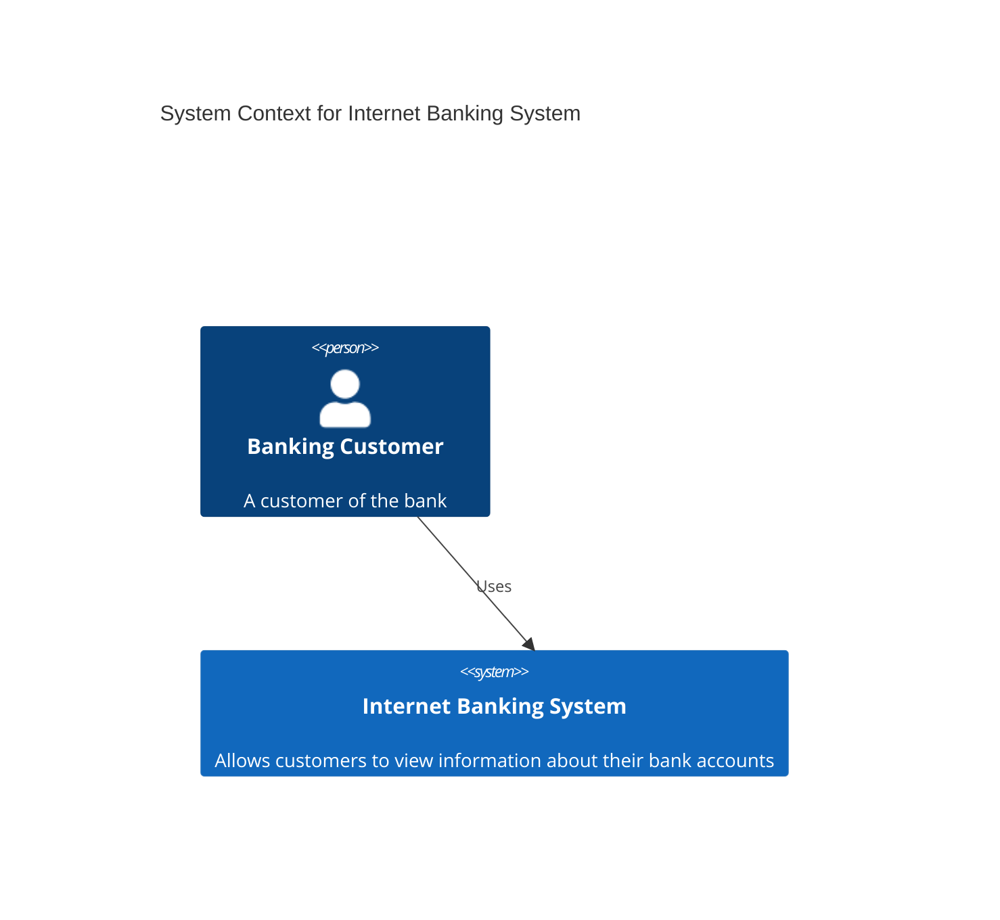
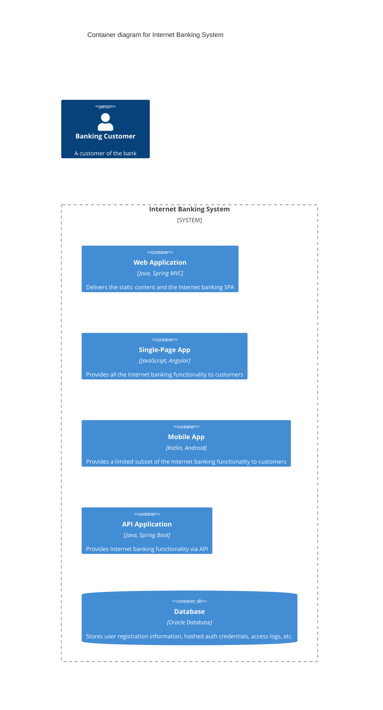
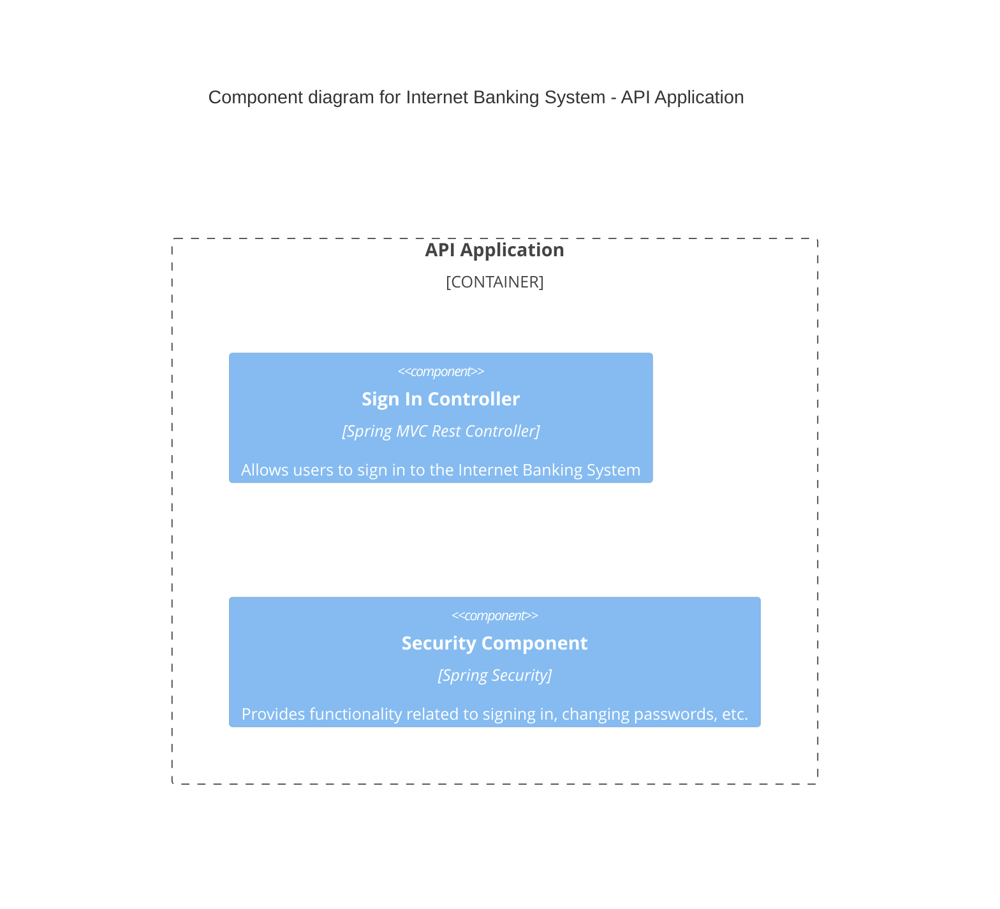

# Диаграмма C4 (архитектура)
Диаграммы C4 в Mermaid позволяют визуализировать архитектуру программного обеспечения на разных уровнях абстракции: Context (контекст системы), Container (контейнеры), Component (компоненты) и Code (код). Mermaid поддерживает экспериментальную поддержку C4-диаграмм, их синтаксис совместим с PlantUML. 

Основные типы C4-диаграмм в Mermaid:
- C4Context — контекстная диаграмма системы, показывает общий обзор: кто использует систему, с какими внешними системами она взаимодействует. 
- C4Container — контейнерная диаграмма, отображает основные строительные блоки системы (API, базы данных, веб-приложения и т. д.). 
- C4Component — компонентная диаграмма, детализирует внутреннюю структуру контейнеров (сервисы, контроллеры, репозитории). 
- C4Dynamic — динамическая/последовательная диаграмма. 
- C4Deployment — диаграмма развёртывания. 

## Примеры диаграмм
Базовый пример C4Context для интернет-банковской системы:

```
C4Context
title System Context for Internet Banking System
Person(customer, "Banking Customer", "A customer of the bank")
System(banking_system, "Internet Banking System", "Allows customers to view information about their bank accounts")
Rel(customer, banking_system, "Uses")
```



Более детальная контейнерная диаграмма для веб-приложения:

```
C4Container
title Container diagram for Internet Banking System
Person(customer, "Banking Customer", "A customer of the bank")
System_Boundary(banking_system, "Internet Banking System") {
    Container(web_app, "Web Application", "Java, Spring MVC", "Delivers the static content and the Internet banking SPA")
    Container(spa, "Single-Page App", "JavaScript, Angular", "Provides all the Internet banking functionality to customers")
    Container(mobile_app, "Mobile App", "Kotlin, Android", "Provides a limited subset of the Internet banking functionality to customers")
    Container(api, "API Application", "Java, Spring Boot", "Provides Internet banking functionality via API")
    ContainerDb(database, "Database", "Oracle Database", "Stores user registration information, hashed auth credentials, access logs, etc.")
}
```



Компонентная диаграмма для API-приложения:

```
C4Component
title Component diagram for Internet Banking System - API Application
Container_Boundary(api, "API Application") {
    Component(sign_in_controller, "Sign In Controller", "Spring MVC Rest Controller", "Allows users to sign in to the Internet Banking System")
    Component(security_component, "Security Component", "Spring Security", "Provides functionality related to signing in, changing passwords, etc.")
}
```


