# Диаграммы
## Создание схем mermaid
Mermaid — это инструмент наподобие Markdown, который преобразует текст в схемы. Например, Mermaid может отображать блок-схемы, схемы последовательностей, круговые диаграммы и др. Чтобы создать схему Mermaid, добавьте фрагмент разметки Mermaid в блок кода с ограждением, указав идентификатор языка mermaid.

Например, можно создать блок-диаграмму, указав значения и стрелки.

```
graph TD;
    A-->B;
    A-->C;
    B-->D;
    C-->D;
```

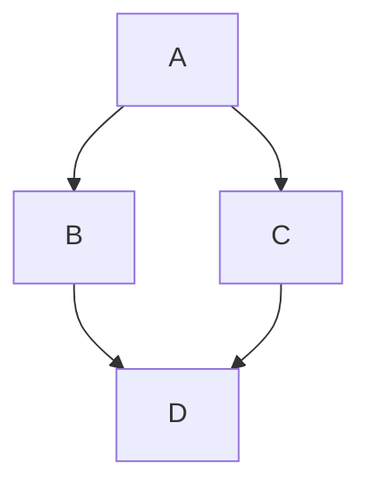

### Проверка версии русалки
Чтобы гарантировать, что GitHub поддерживает синтаксис русалки, проверьте используемую в настоящее время версию mermaid.

```
  info
```

```mermaid
  info
```
### Блок-схема
[см. файл с описанием блок-схем](https://github.com/Shmetroff/test-git/blob/master/flowcharts.md "Блок-схемы")

### Круговые диаграммы
Круговая диаграмма — популярный и простой способ показать какую часть от общего числа занимает отдельные части. В Mermaid круговые диаграммы задаются с помощью ключевого слова pie, далее следует слово title, позволяющее задать название диаграммы и строка с самим названием. Но titlte можно опустить и не использовать, тогда диаграмма будет безымянной.

Данные в диаграмму записываются построчно следующим образом:
- название в кавычках;
- разделитель в виде двоеточия;
- положительное числовое значение (поддерживается до двух знаков после запятой).

```
pie title Продажи легких закусок за декабрь 2021
    "Сендвичи" : 223
    "Салаты" : 50
    "Канапе" : 100
```

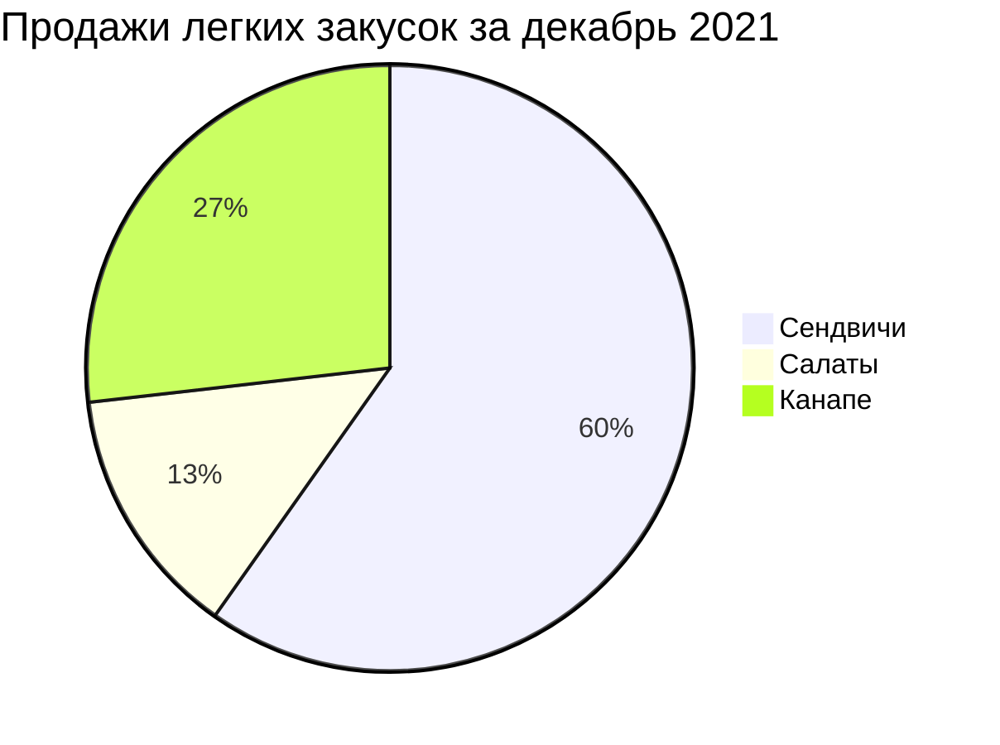

### Диаграммы пользовательского пути
С помощью диаграммы пользовательского пути можно продемонстрировать процесс того, как каждый тип пользователя пользуется мобильным или веб приложением. Для создания подобных схем в Mermaid есть ключевое слово journey, title также отвечает за название всей диаграммы. С помощью section можно задавать разделы. В каждом разделе указываются конкретные шаги с оценкой по десятибалльной шкале и закрепленным за действием лицом. Все эти данные следует вводить через разделитель в виде двоеточия.

```
journey
    title Процесс написания статьи
    section Поиск / изучение
      Поиск информации: 5: Я
      Структурирование: 5: Я
    section Пишем
      Пишем черновик: 5: Я
      Готовим картинки: 4: Я
    section Редактируем
        Проверяем: 3: Я
        Финальные правки: 2: Я
    section Публикация
        Публикуем: 5: Я
        Радуемся: 8: Я, Мой кот
```

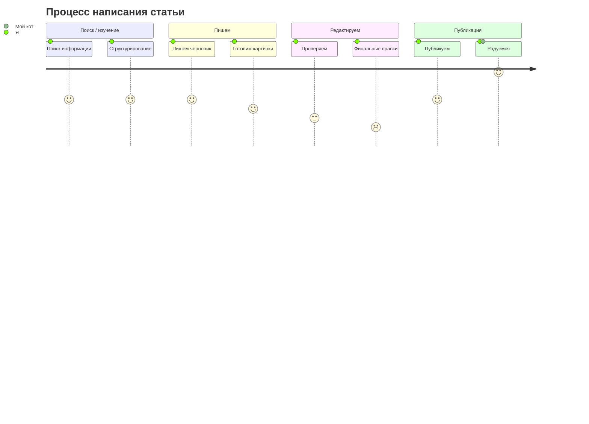

### Диаграмма Ганта
Диаграмма Ганта часто применяется в приложениях для планирования и отображает процесс работы над проектом. Обычно такая диаграмма состоит из двух основных частей — временной шкалы и задач. Подобные виды отслеживания задач довольно популярны и первую версию придумали аж в 1910 году, поэтому за более чем сотню лет появились альтернативные и расширенные виды. Но у всех вариантов всегда одна и таже задача. 

В Mermaid диаграммы Ганта состоят из двух частей — на оси X находится шкала времени, а на оси Y задачи и порядок их выполнения. Такой вид диаграммы задается ключевым словом gantt, в title вписывается название. Далее следует указать формат даты, который система будет принимать для рендеринга итоговой диаграммы (dateFormat). Разделы по оси Y задаются с помощью ключевого слова section и названия раздела. А далее следует указывать сами задачи, которые состоят из короткого текста задачи, имени, даты начала и продолжительности. При этом текст задачи располагается с левой части, а остальные параметры с правой и разделяются запятой. Через ключевое слово after можно явно указать последовательность задач в рамках раздела, если этого не сделать, то система сама расположит их по порядку.

```
gantt
    title Диаграмма Ганта
    dateFormat  YYYY-MM-DD
    section Секция 1
    Задача 1         :a1, 2014-01-01, 15d
    Задача 2         :20d
    section Секция 2
    Задача 1         :2014-01-12  , 12d
    Задача 2         : 24d
```

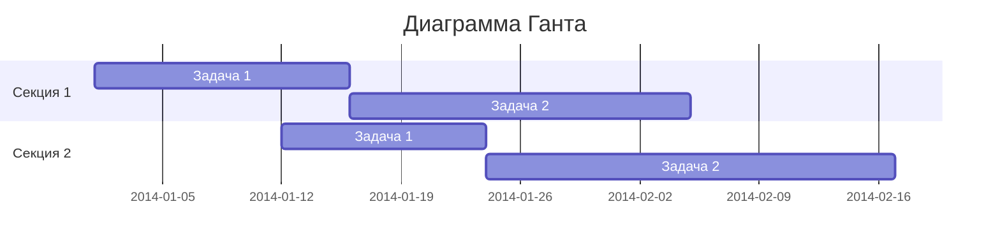

Для каждой задачи существуют несколько параметров, которые указывают на ее состояние:
- crit — особенно важные задачи;
- active — задачи в работе;
- done — выполненные задачи;
- milestone — вехи (единичные важные события).

```
gantt
    title Диаграмма Ганта
    dateFormat  YYYY-MM-DD
    section Секция 1
    Milestone   :milestone, a1, 2014-01-01, 15d
    Crit        :crit, a2, 2014-01-01, 15d 
    Active      :active, a3, 2014-01-01, 15d
    Done        :done, a4, 2014-01-01, 15d
```

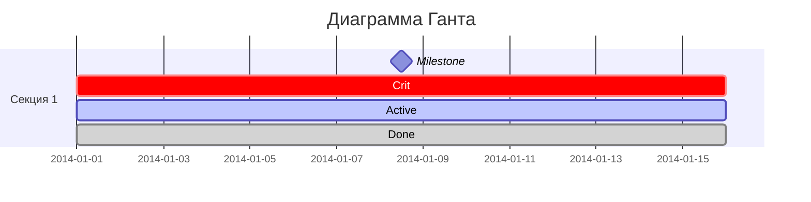

### UML-диаграммы
[см. файл с описанием UML-диаграмм](https://github.com/Shmetroff/test-git/blob/master/classcharts.md "UML-диаграммы")

### Диаграмма состояния
[см. файл с описанием диаграмм состояния](https://github.com/Shmetroff/test-git/blob/master/statecharts.md "Диаграммы состояния")

### ER-модель
[см. файл с описанием ER-диаграмм](https://github.com/Shmetroff/test-git/blob/master/ercharts.md "ER-диаграммы")

### Диаграммы последовательности
[см. файл с описанием диаграмм последовательности](https://github.com/Shmetroff/test-git/blob/master/seqcharts.md "Диаграммы последовательности")

### Диаграмма Gitgraph (Git): Визуализирует ветки и коммиты Git
С его помощью можно наглядно отобразить историю репозитория, включая коммиты, ветки и слияния. 

#### Базовый синтаксис
Основные команды для создания GitGraph в Mermaid:
- commit — добавляет новый коммит в текущую ветку;
- branch [name] — создаёт новую ветку и переключается на неё;
- checkout [branch] — переключается на существующую ветку;
- merge [branch] — сливает указанную ветку в текущую. 
Можно также использовать команду cherry-pick [id] для выбора конкретного коммита.

Пример базового GitGraph:

```
gitGraph
  commit
  commit
  branch develop
  checkout develop
  commit
  commit
  checkout main
  merge develop
  commit
```

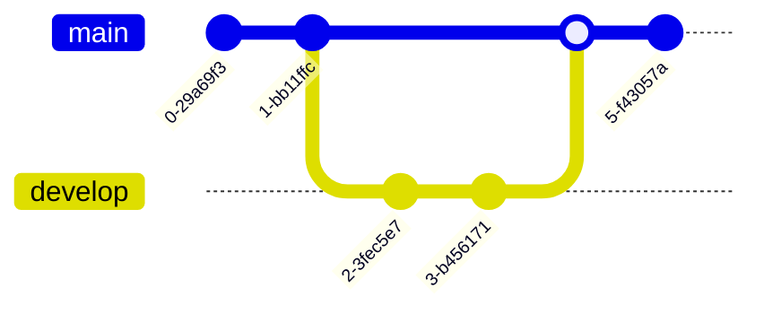

В этом примере:
- Созданы два коммита в ветке main.
- Создана ветка develop и переключены на неё.
- В ветке develop сделано два коммита.
- Переключились обратно на main.
- Ветка develop слита в main.
- В main сделан ещё один коммит. 

Расширенный пример.

Пример, демонстрирующий рабочий процесс разработки функций:

```
gitGraph
  commit id: "Initial commit"
  commit id: "Add README"
  branch develop
  checkout develop
  commit id: "Set up project structure"
  branch feature/login
  checkout feature/login
  commit id: "Add login form"
  commit id: "Add authentication"
  checkout develop
  merge feature/login
  branch feature/dashboard
  checkout feature/dashboard
  commit id: "Create dashboard layout"
  commit id: "Add widgets"
  checkout develop
  merge feature/dashboard
  checkout main
  merge develop
```

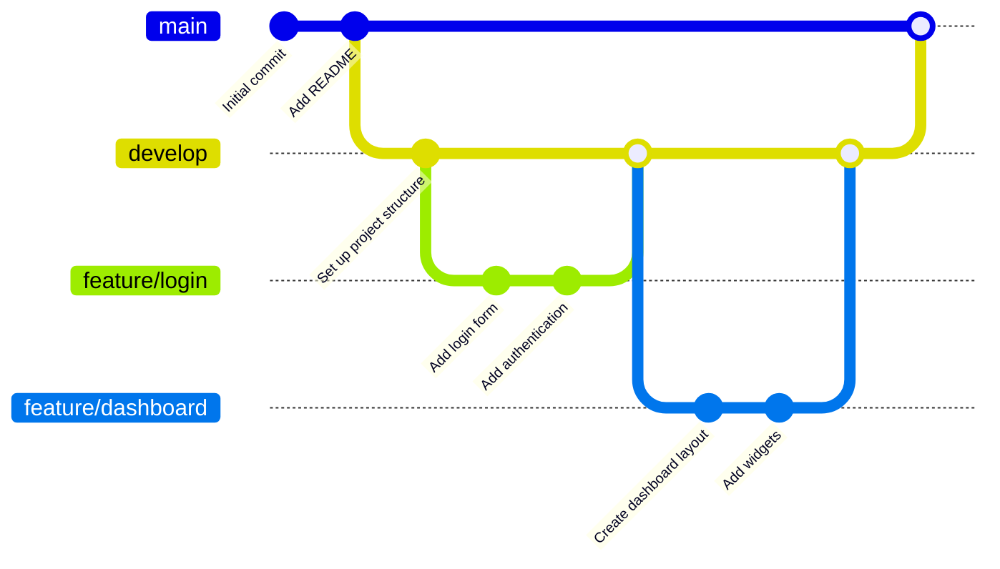

Здесь показано создание основной ветки, развитие функций в отдельных ветках (feature/login, feature/dashboard), их слияние в develop, а затем в main. 

#### Дополнительные возможности
Пользовательские ID для коммитов. Можно задать собственный ID для коммита с помощью атрибута id: "ваш_ID".

Типы коммитов. Можно указывать тип коммита (например, NORMAL, REVERSE, HIGHLIGHT).

Теги и релизы. Для добавления тегов используется tag: "название_тега".

Ориентация графика. По умолчанию график строится слева направо. Можно изменить ориентацию, добавив после gitGraph ключевое слово: LR (слева направо, по умолчанию), TB (сверху вниз), BT (снизу вверх).

Можно управлять отображением веток (showBranches), меток коммитов (showCommitLabel), названием основной ветки (mainBranchName) и другими параметрами. 

### Карты мыслей (Mindmaps)
Синтаксис основан на отступах для определения уровней иерархии, а узлы могут иметь разные формы и иконки. 

#### Базовый синтаксис
Ментальная карта начинается с ключевого слова mindmap. Корневой узел (центральная идея) указывается после него. Дочерние узлы создаются с помощью отступов. 

Пример простой ментальной карты:

```
mindmap
root((Central Idea))
    Main Topic 1
        Subtopic A
        Subtopic B
    Main Topic 2
        Subtopic C
        Subtopic D
```

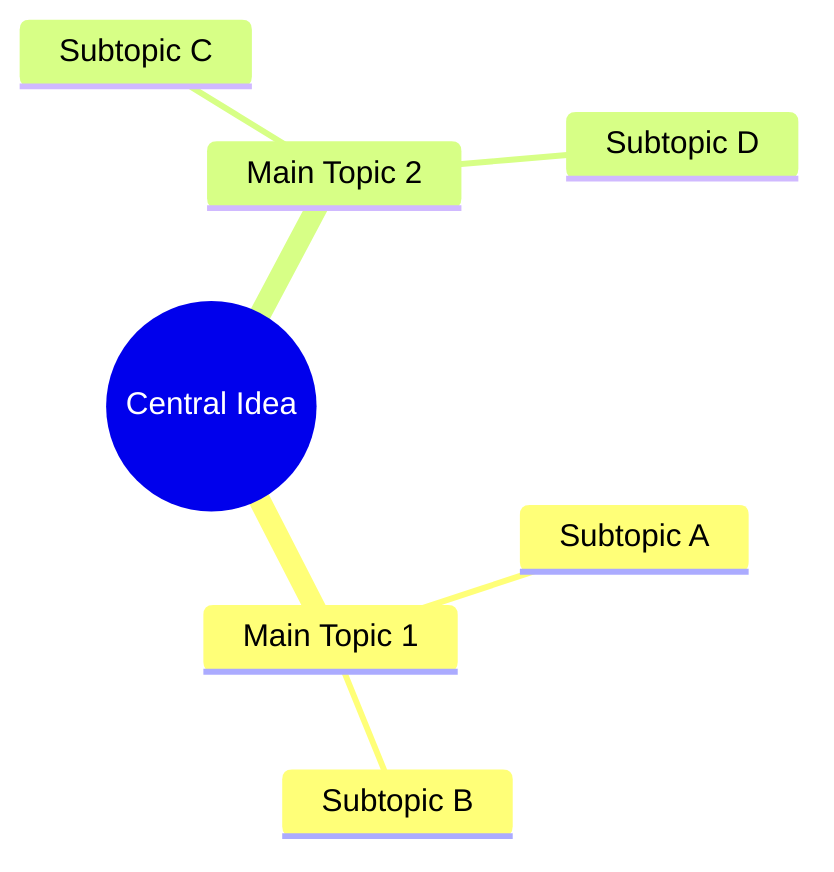

В этом примере Central Idea — корневой узел, Main Topic 1 и Main Topic 2 — основные ветви, а Subtopic A, Subtopic B, Subtopic C, Subtopic D — подтемы.

#### Формы узлов
Mermaid поддерживает разные формы узлов. Для их указания используется синтаксис, аналогичный блок-схемам: идентификатор узла, за которым следует определение формы и текст внутри разделителей. 

|Форма	|Синтаксис	|Пример    |
|-    |-    |-    |
|Круг	|((text))	|((Circle Node))    |
|Квадрат	|[text]	|[Square Node]    |
|Скруглённый прямоугольник	|(text)	|(Rounded Node)    |
|Шестиугольник	|{{text}}	|{{Hexagon Node}}    |
|Облако	|))text((	|))Cloud Node((    |
|«Бантик»	|)text(	|)Bang Node(    |

Пример с разными формами:

```
mindmap
root((Central Topic))
    [Square Branch]
        ((Circular Subtopic))
    (Rounded Branch)
        {{Hexagonal Subtopic}}
```

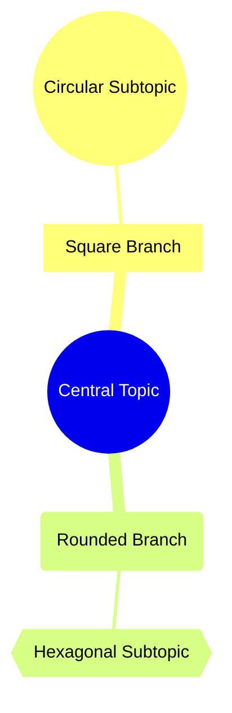

#### Иконки (не работает в GitHub)
К узлам можно добавлять иконки из Font Awesome или Material Design. Синтаксис: ::icon(класс_иконки). 

Пример с иконками:

```
mindmap
root((Project Planning))
    [Priority Tasks]::icon(fa fa-star)
        Task 1
        Task 2
    [Timeline]::icon(fa fa-calendar)
        Week 1
        Week 2
    [Resources]::icon(fa fa-users)
        Team A
        Team B
```

#### Классы стилей
Узлам можно присваивать CSS-классы с помощью суффикса :::className. Это позволяет стилизовать узлы на уровне темы.

Пример:

```
mindmap
root((System))
    Critical path:::urgent
        Auth service
        Payment gateway
    Nice to have:::optional
        Dark mode
        Export to PDF
```

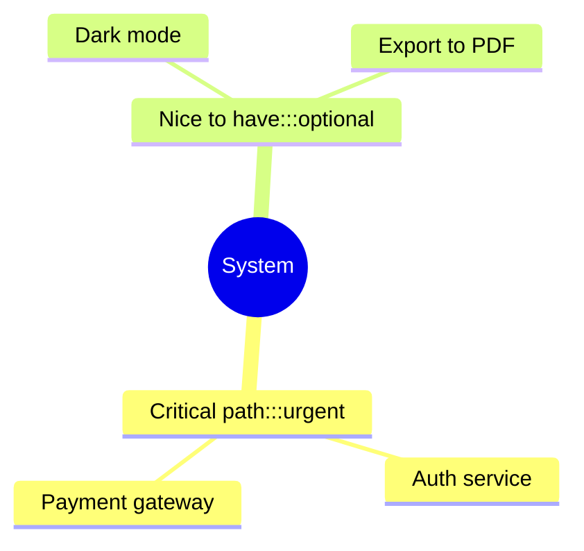

Пример сложной ментальной карты.

Тема: веб-разработка:

```
mindmap
root((Web Development))
    Frontend
        HTML
            Structure
            Semantics
        CSS
            Styling
            Layout
                Flexbox
                Grid
            Animation
        JavaScript
            DOM
            Events
            Frameworks
                React
                Vue
                Angular
    Backend
        Languages
            Python
            Node.js
            Java
        Frameworks
            Express
            Django
            Spring
    Database
        SQL
            MySQL
            PostgreSQL
        NoSQL
            MongoDB
            Redis
    DevOps
        Version Control
            Git
            SVN
        CI/CD
            Jenkins
            GitHub Actions
        Deployment
            Docker
            Kubernetes
```

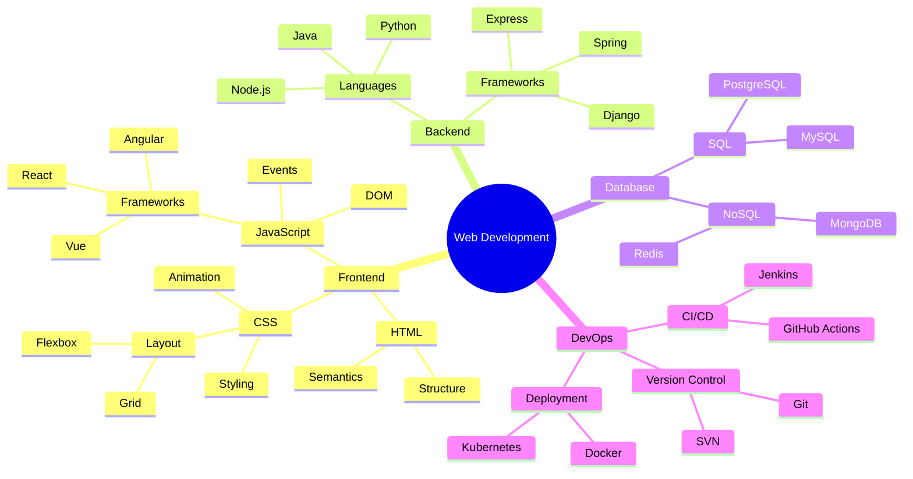

#### Важные замечания
Mermaid mind maps строго иерархичны: узел может соединяться только с одним родительским узлом. 
Нельзя переставлять узлы с помощью перетаскивания — иерархия фиксируется отступами. 
Невозможно встраивать изображения или файлы в узлы. 
Рендер диаграммы — только визуальный, интерактивного редактирования нет

### Диаграмма требований (Requirement Diagram)
Это визуальное представление требований к системе, их связей с другими элементами и документированными данными. Такие диаграммы следуют стандартам SysML v1.6 и помогают наглядно отобразить зависимости, риски и методы проверки.

#### Основные компоненты диаграммы требований
В диаграмме требований есть три типа компонентов:
- Требования — определяют требования с атрибутами (тип, ID, текст, риск, метод проверки).
- Элементы — связаны с требованиями, могут иметь тип и ссылку на документ.
- Отношения — определяют связи между требованиями и элементами или между несколькими требованиями.
 
Синтаксис определения требования:
```
<type> user_defined_name {
    id: user_defined_id
    text: user-defined text
    risk: <risk>
    verifymethod: <method>
}
```

Возможные типы требований: requirement, functionalRequirement, interfaceRequirement, performanceRequirement, physicalRequirement, designConstraint. 

Примеры значений для risk: Low, Medium, High. Для verifymethod — Analysis, Inspection, Test, Demonstration. 

Пример диаграммы с несколькими требованиями и элементами:

```
requirementDiagram

interfaceRequirement dark_theme {
    id: 1
    text: Dark Themes Rule!
    risk: low
    verifymethod: demonstration
}

performanceRequirement load_time {
    id: 2
    text: 200ms or less
    risk: medium
    verifymethod: test
}

functionalRequirement accessibility {
    id: 3
    text: Contrast
    risk: low
    verifymethod: inspection
}

element revised_skin {
    type: css
    docRef: theme.css
}

element perf_test {
    type: unit test
    docRef: LoadTest.cs
}

revised_skin - satisfies -> dark_theme
revised_skin - satisfies -> load_time
load_time - satisfies -> accessibility
```

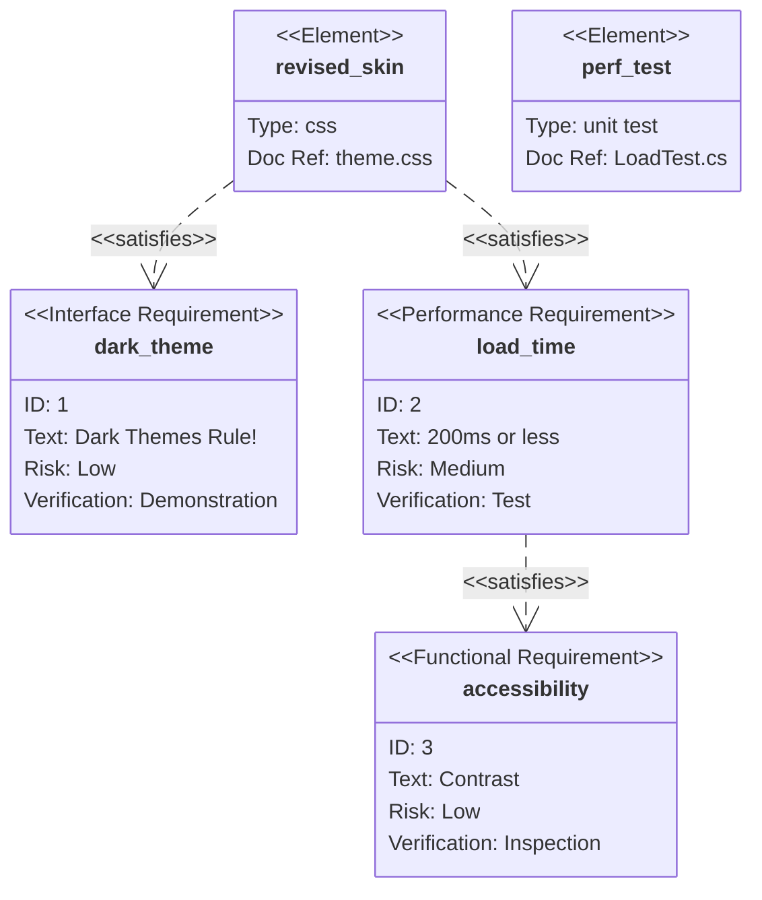

Типы отношений между элементами:
- contains;
- copies;
- derives;
- satisfies;
- verifies;
- refines;
- traces.

### Диаграмма C4 (архитектура)
Диаграммы C4 в Mermaid позволяют визуализировать архитектуру программного обеспечения на разных уровнях абстракции: Context (контекст системы), Container (контейнеры), Component (компоненты) и Code (код). Mermaid поддерживает экспериментальную поддержку C4-диаграмм, их синтаксис совместим с PlantUML. 

Основные типы C4-диаграмм в Mermaid:
- C4Context — контекстная диаграмма системы, показывает общий обзор: кто использует систему, с какими внешними системами она взаимодействует. 
- C4Container — контейнерная диаграмма, отображает основные строительные блоки системы (API, базы данных, веб-приложения и т. д.). 
- C4Component — компонентная диаграмма, детализирует внутреннюю структуру контейнеров (сервисы, контроллеры, репозитории). 
- C4Dynamic — динамическая/последовательная диаграмма. 
- C4Deployment — диаграмма развёртывания. 

#### Примеры диаграмм
Базовый пример C4Context для интернет-банковской системы:

```
C4Context
title System Context for Internet Banking System
Person(customer, "Banking Customer", "A customer of the bank")
System(banking_system, "Internet Banking System", "Allows customers to view information about their bank accounts")
Rel(customer, banking_system, "Uses")
```

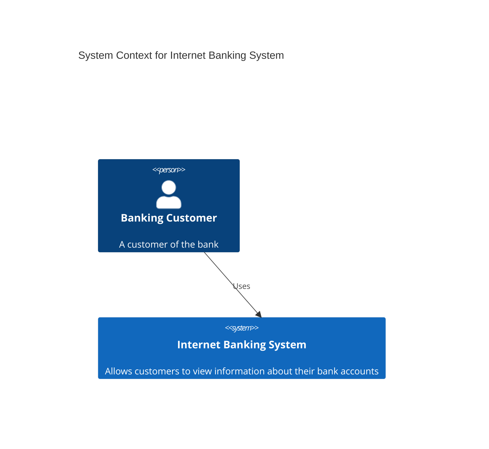

Более детальная контейнерная диаграмма для веб-приложения:

```
C4Container
title Container diagram for Internet Banking System
Person(customer, "Banking Customer", "A customer of the bank")
System_Boundary(banking_system, "Internet Banking System") {
    Container(web_app, "Web Application", "Java, Spring MVC", "Delivers the static content and the Internet banking SPA")
    Container(spa, "Single-Page App", "JavaScript, Angular", "Provides all the Internet banking functionality to customers")
    Container(mobile_app, "Mobile App", "Kotlin, Android", "Provides a limited subset of the Internet banking functionality to customers")
    Container(api, "API Application", "Java, Spring Boot", "Provides Internet banking functionality via API")
    ContainerDb(database, "Database", "Oracle Database", "Stores user registration information, hashed auth credentials, access logs, etc.")
}
```

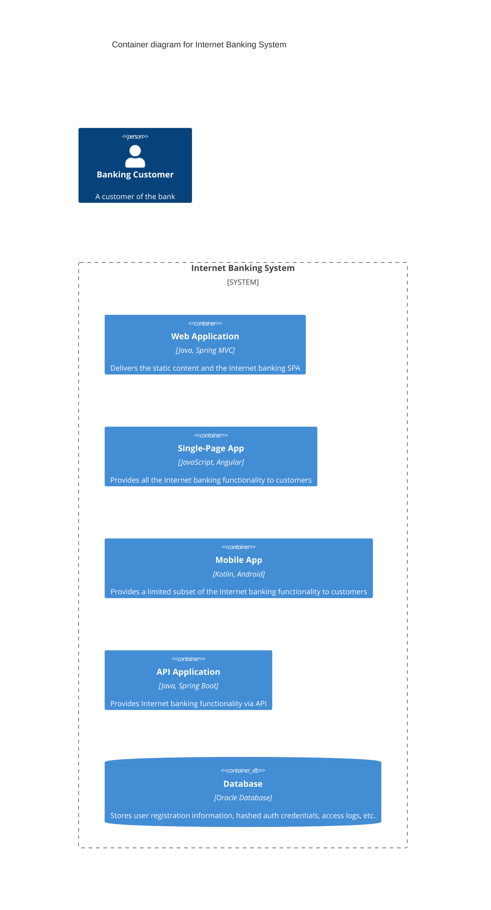

Компонентная диаграмма для API-приложения:

```
C4Component
title Component diagram for Internet Banking System - API Application
Container_Boundary(api, "API Application") {
    Component(sign_in_controller, "Sign In Controller", "Spring MVC Rest Controller", "Allows users to sign in to the Internet Banking System")
    Component(security_component, "Security Component", "Spring Security", "Provides functionality related to signing in, changing passwords, etc.")
}
```

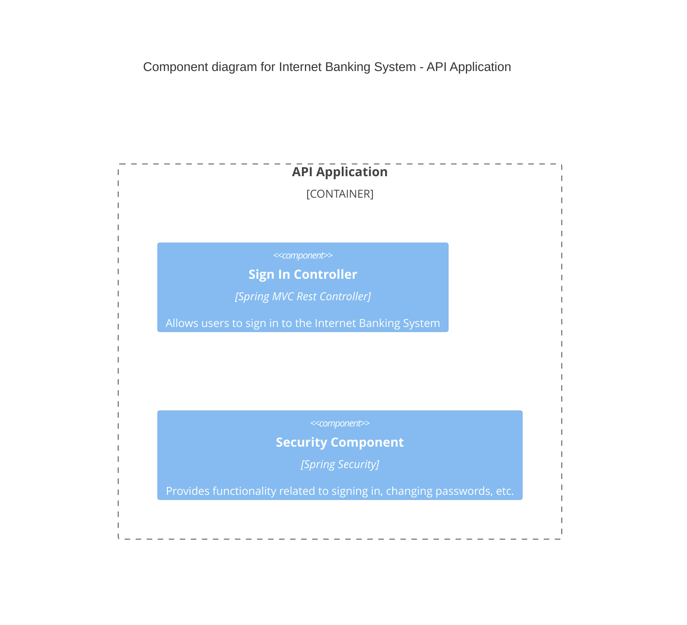

### Создание трехмерных моделей STL
Синтаксис ASCII STL можно использовать непосредственно в Markdown для создания интерактивных трехмерных моделей. Чтобы отобразить модель, добавьте разметку ASCII STL в блок кода с ограждением, указав идентификатор синтаксиса stl.

Например, можно создать простую трехмерную модель:

```
solid cube_corner
  facet normal 0.0 -1.0 0.0
    outer loop
      vertex 0.0 0.0 0.0
      vertex 1.0 0.0 0.0
      vertex 0.0 0.0 1.0
    endloop
  endfacet
  facet normal 0.0 0.0 -1.0
    outer loop
      vertex 0.0 0.0 0.0
      vertex 0.0 1.0 0.0
      vertex 1.0 0.0 0.0
    endloop
  endfacet
  facet normal -1.0 0.0 0.0
    outer loop
      vertex 0.0 0.0 0.0
      vertex 0.0 0.0 1.0
      vertex 0.0 1.0 0.0
    endloop
  endfacet
  facet normal 0.577 0.577 0.577
    outer loop
      vertex 1.0 0.0 0.0
      vertex 0.0 1.0 0.0
      vertex 0.0 0.0 1.0
    endloop
  endfacet
endsolid
```

```stl
solid cube_corner
  facet normal 0.0 -1.0 0.0
    outer loop
      vertex 0.0 0.0 0.0
      vertex 1.0 0.0 0.0
      vertex 0.0 0.0 1.0
    endloop
  endfacet
  facet normal 0.0 0.0 -1.0
    outer loop
      vertex 0.0 0.0 0.0
      vertex 0.0 1.0 0.0
      vertex 1.0 0.0 0.0
    endloop
  endfacet
  facet normal -1.0 0.0 0.0
    outer loop
      vertex 0.0 0.0 0.0
      vertex 0.0 0.0 1.0
      vertex 0.0 1.0 0.0
    endloop
  endfacet
  facet normal 0.577 0.577 0.577
    outer loop
      vertex 1.0 0.0 0.0
      vertex 0.0 1.0 0.0
      vertex 0.0 0.0 1.0
    endloop
  endfacet
endsolid
```
