# Диаграммы
## Создание схем mermaid
Mermaid — это инструмент наподобие Markdown, который преобразует текст в схемы. Например, Mermaid может отображать блок-схемы, схемы последовательностей, круговые диаграммы и др. Чтобы создать схему Mermaid, добавьте фрагмент разметки Mermaid в блок кода с ограждением, указав идентификатор языка mermaid.

Например, можно создать блок-диаграмму, указав значения и стрелки.

```
graph TD;
    A-->B;
    A-->C;
    B-->D;
    C-->D;
```

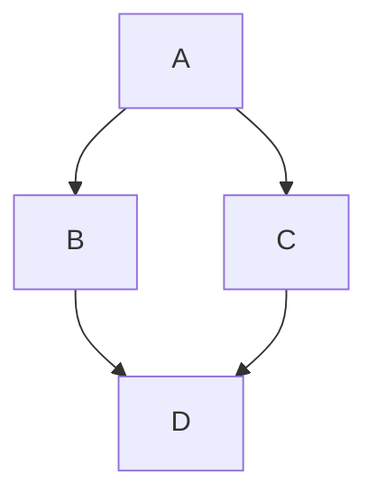

### Проверка версии русалки
Чтобы гарантировать, что GitHub поддерживает синтаксис русалки, проверьте используемую в настоящее время версию mermaid.

```
  info
```

```mermaid
  info
```
### Блок-схема
[см. файл с описанием блок-схем](https://github.com/Shmetroff/test-git/blob/master/flowcharts.md "Блок-схемы")

### Круговые диаграммы
Круговая диаграмма — популярный и простой способ показать какую часть от общего числа занимает отдельные части. В Mermaid круговые диаграммы задаются с помощью ключевого слова pie, далее следует слово title, позволяющее задать название диаграммы и строка с самим названием. Но titlte можно опустить и не использовать, тогда диаграмма будет безымянной.

Данные в диаграмму записываются построчно следующим образом:
- название в кавычках;
- разделитель в виде двоеточия;
- положительное числовое значение (поддерживается до двух знаков после запятой).

```
pie title Продажи легких закусок за декабрь 2021
    "Сендвичи" : 223
    "Салаты" : 50
    "Канапе" : 100
```

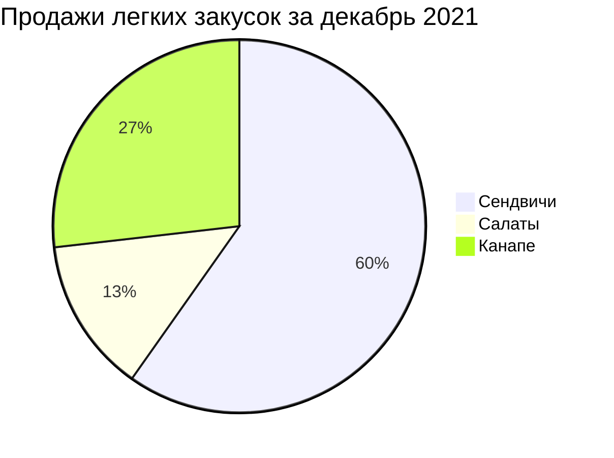

### Диаграммы пользовательского пути
С помощью диаграммы пользовательского пути можно продемонстрировать процесс того, как каждый тип пользователя пользуется мобильным или веб приложением. Для создания подобных схем в Mermaid есть ключевое слово journey, title также отвечает за название всей диаграммы. С помощью section можно задавать разделы. В каждом разделе указываются конкретные шаги с оценкой по десятибалльной шкале и закрепленным за действием лицом. Все эти данные следует вводить через разделитель в виде двоеточия.

```
journey
    title Процесс написания статьи
    section Поиск / изучение
      Поиск информации: 5: Я
      Структурирование: 5: Я
    section Пишем
      Пишем черновик: 5: Я
      Готовим картинки: 4: Я
    section Редактируем
        Проверяем: 3: Я
        Финальные правки: 2: Я
    section Публикация
        Публикуем: 5: Я
        Радуемся: 8: Я, Мой кот
```

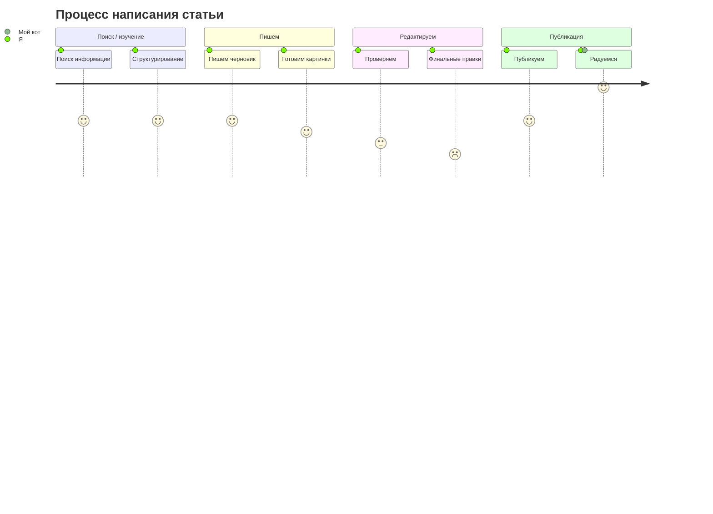

### Диаграмма Ганта
[см. файл с описанием диаграмм Ганта](https://github.com/Shmetroff/test-git/blob/master/ganttcharts.md "Диаграммы Ганта")

### UML-диаграммы
[см. файл с описанием UML-диаграмм](https://github.com/Shmetroff/test-git/blob/master/classcharts.md "UML-диаграммы")

### Диаграмма состояния
[см. файл с описанием диаграмм состояния](https://github.com/Shmetroff/test-git/blob/master/statecharts.md "Диаграммы состояния")

### ER-модель
[см. файл с описанием ER-диаграмм](https://github.com/Shmetroff/test-git/blob/master/ercharts.md "ER-диаграммы")

### Диаграммы последовательности
[см. файл с описанием диаграмм последовательности](https://github.com/Shmetroff/test-git/blob/master/seqcharts.md "Диаграммы последовательности")

### Диаграмма Gitgraph (Git): Визуализирует ветки и коммиты Git
[см. файл с описанием диаграмм Gitgraph](https://github.com/Shmetroff/test-git/blob/master/gitgraphs.md "Диаграммы Gitgraph")

### Карты мыслей (Mindmaps)
[см. файл с описанием Mindmaps диаграмм](https://github.com/Shmetroff/test-git/blob/master/mindmaps.md "Диаграммы Mindmaps")

### Диаграмма требований (Requirement Diagram)
Это визуальное представление требований к системе, их связей с другими элементами и документированными данными. Такие диаграммы следуют стандартам SysML v1.6 и помогают наглядно отобразить зависимости, риски и методы проверки.

#### Основные компоненты диаграммы требований
В диаграмме требований есть три типа компонентов:
- Требования — определяют требования с атрибутами (тип, ID, текст, риск, метод проверки).
- Элементы — связаны с требованиями, могут иметь тип и ссылку на документ.
- Отношения — определяют связи между требованиями и элементами или между несколькими требованиями.
 
Синтаксис определения требования:
```
<type> user_defined_name {
    id: user_defined_id
    text: user-defined text
    risk: <risk>
    verifymethod: <method>
}
```

Возможные типы требований: requirement, functionalRequirement, interfaceRequirement, performanceRequirement, physicalRequirement, designConstraint. 

Примеры значений для risk: Low, Medium, High. Для verifymethod — Analysis, Inspection, Test, Demonstration. 

Пример диаграммы с несколькими требованиями и элементами:

```
requirementDiagram

interfaceRequirement dark_theme {
    id: 1
    text: Dark Themes Rule!
    risk: low
    verifymethod: demonstration
}

performanceRequirement load_time {
    id: 2
    text: 200ms or less
    risk: medium
    verifymethod: test
}

functionalRequirement accessibility {
    id: 3
    text: Contrast
    risk: low
    verifymethod: inspection
}

element revised_skin {
    type: css
    docRef: theme.css
}

element perf_test {
    type: unit test
    docRef: LoadTest.cs
}

revised_skin - satisfies -> dark_theme
revised_skin - satisfies -> load_time
load_time - satisfies -> accessibility
```

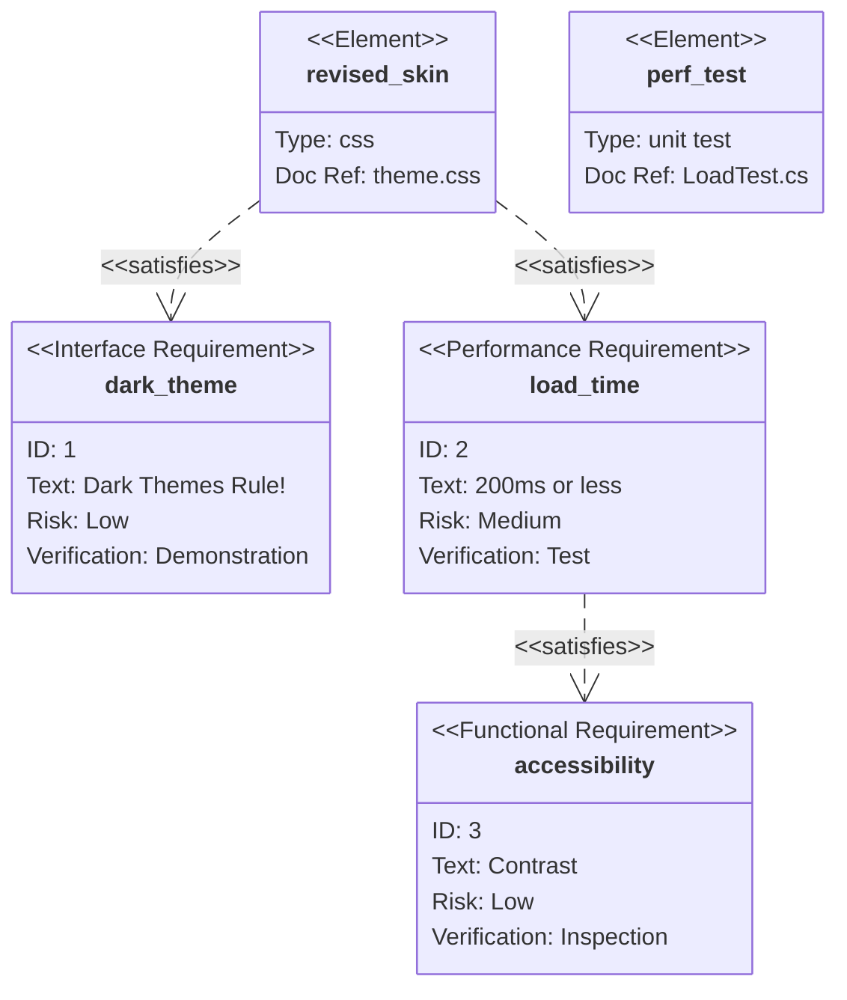

Типы отношений между элементами:
- contains;
- copies;
- derives;
- satisfies;
- verifies;
- refines;
- traces.

### Диаграмма C4 (архитектура)
Диаграммы C4 в Mermaid позволяют визуализировать архитектуру программного обеспечения на разных уровнях абстракции: Context (контекст системы), Container (контейнеры), Component (компоненты) и Code (код). Mermaid поддерживает экспериментальную поддержку C4-диаграмм, их синтаксис совместим с PlantUML. 

Основные типы C4-диаграмм в Mermaid:
- C4Context — контекстная диаграмма системы, показывает общий обзор: кто использует систему, с какими внешними системами она взаимодействует. 
- C4Container — контейнерная диаграмма, отображает основные строительные блоки системы (API, базы данных, веб-приложения и т. д.). 
- C4Component — компонентная диаграмма, детализирует внутреннюю структуру контейнеров (сервисы, контроллеры, репозитории). 
- C4Dynamic — динамическая/последовательная диаграмма. 
- C4Deployment — диаграмма развёртывания. 

#### Примеры диаграмм
Базовый пример C4Context для интернет-банковской системы:

```
C4Context
title System Context for Internet Banking System
Person(customer, "Banking Customer", "A customer of the bank")
System(banking_system, "Internet Banking System", "Allows customers to view information about their bank accounts")
Rel(customer, banking_system, "Uses")
```

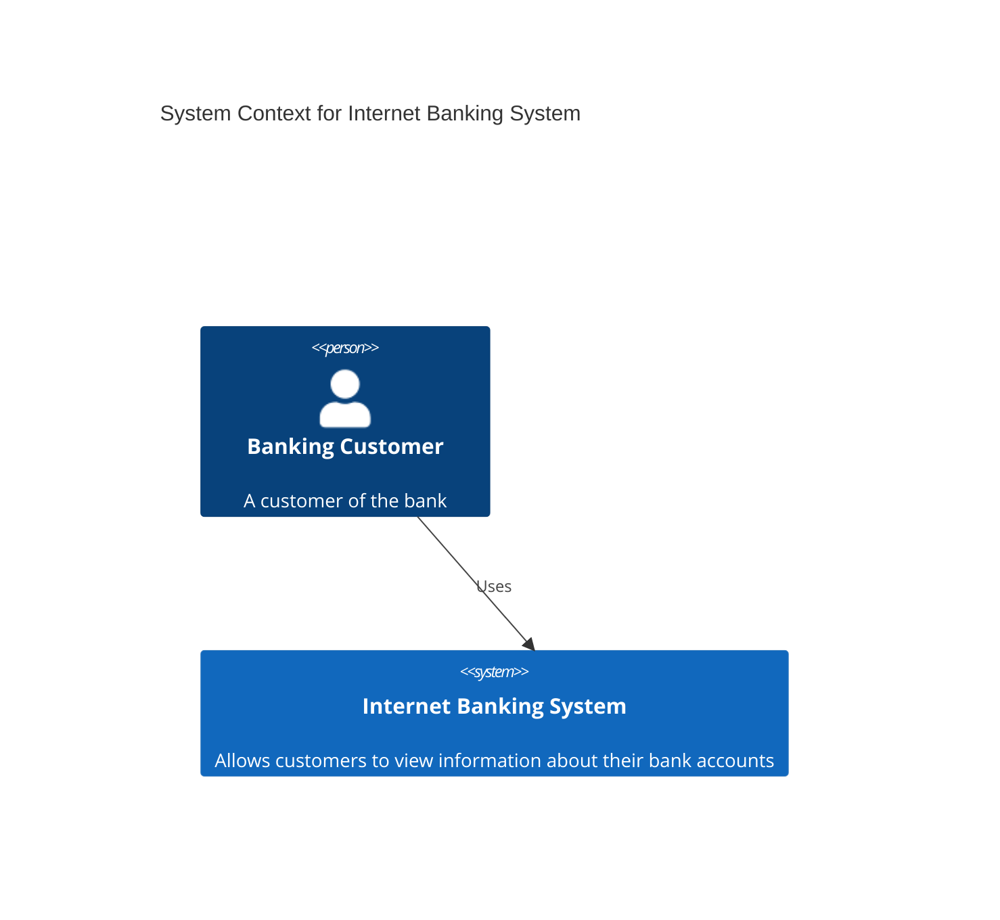

Более детальная контейнерная диаграмма для веб-приложения:

```
C4Container
title Container diagram for Internet Banking System
Person(customer, "Banking Customer", "A customer of the bank")
System_Boundary(banking_system, "Internet Banking System") {
    Container(web_app, "Web Application", "Java, Spring MVC", "Delivers the static content and the Internet banking SPA")
    Container(spa, "Single-Page App", "JavaScript, Angular", "Provides all the Internet banking functionality to customers")
    Container(mobile_app, "Mobile App", "Kotlin, Android", "Provides a limited subset of the Internet banking functionality to customers")
    Container(api, "API Application", "Java, Spring Boot", "Provides Internet banking functionality via API")
    ContainerDb(database, "Database", "Oracle Database", "Stores user registration information, hashed auth credentials, access logs, etc.")
}
```

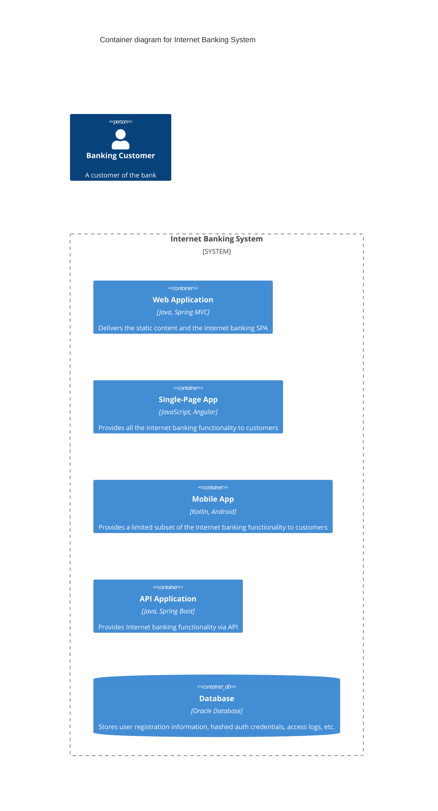

Компонентная диаграмма для API-приложения:

```
C4Component
title Component diagram for Internet Banking System - API Application
Container_Boundary(api, "API Application") {
    Component(sign_in_controller, "Sign In Controller", "Spring MVC Rest Controller", "Allows users to sign in to the Internet Banking System")
    Component(security_component, "Security Component", "Spring Security", "Provides functionality related to signing in, changing passwords, etc.")
}
```

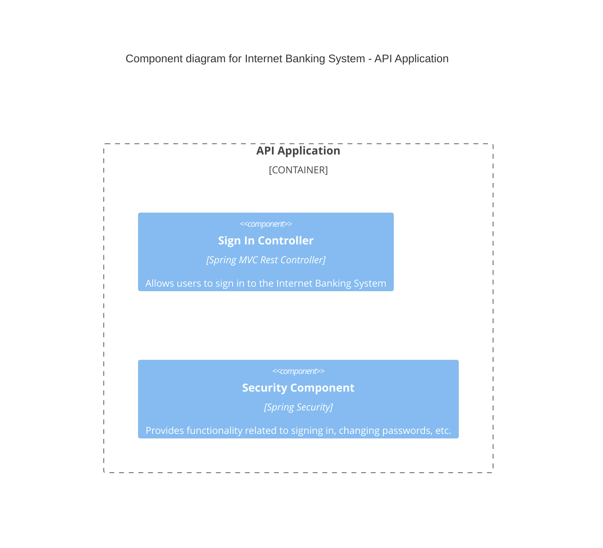

### Диаграмма потоков (Sankey Diagram)
Sankey-диаграмма в Mermaid — это визуализация потока данных между узлами, где ширина связи пропорциональна величине потока. Такие диаграммы часто используют для отображения распределения энергии, ресурсов, финансовых потоков или пользовательских путей.

#### Базовый синтаксис
Диаграмма начинается с ключевого слова sankey-beta, за которым следуют данные в формате CSV с тремя столбцами: source (исходный узел), target (целевой узел), value (величина потока). 

Пример кода:

```
sankey-beta
source, target, value
Portfolio, Investments, 70
Portfolio, Cash & Equivalents, 30
Investments, Equities, 50
Investments, Bonds, 20
Equities, US, 30
Equities, Others, 20
```

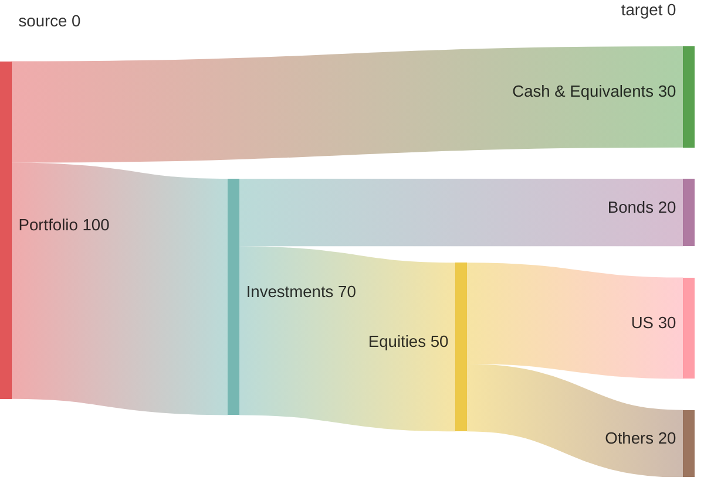

#### Особенности синтаксиса
Пустые строки. В отличие от стандартного CSV, в Mermaid можно использовать пустые строки для лучшей визуальной организации.
Запятые в метках узлов. Если в метке узла есть запятая, её нужно заключить в двойные кавычки.
Двойные кавычки в метках. Чтобы включить двойные кавычки в метку узла, используйте две двойные кавычки внутри кавычек.

Можно настраивать внешний вид диаграммы с помощью параметров. Цвета связей. linkColor может быть:
- source — цвет связи соответствует цвету исходного узла;
- target — цвет связи соответствует цвету целевого узла;
- gradient — плавный переход между цветами исходного и целевого узлов;
- шестнадцатеричный код цвета (например, #a1a1a1).

Выравнивание узлов. nodeAlignment может быть justify (распределение узлов равномерно), center (центральное выравнивание), left (выравнивание по левому краю), right (выравнивание по правому краю).

Размеры диаграммы. Можно задать ширину и высоту с помощью параметров width и height.

### Графики по осям X и Y (XYChart)
XY-диаграммы в Mermaid — это инструмент визуализации данных, который использует две оси (X и Y) для представления информации. На момент 2025 года в Mermaid поддерживаются два основных типа таких диаграмм: столбчатые (bar) и линейные (line). 

#### Пример синтаксиса
Базовый пример создания столбчатой диаграммы:

```
xychart-beta
title "Monthly Revenue"
x-axis [Jan, Feb, Mar, Apr, May, Jun]
y-axis "Revenue (K)" 0 --> 500
bar [180, 250, 310, 280, 350, 420]
```

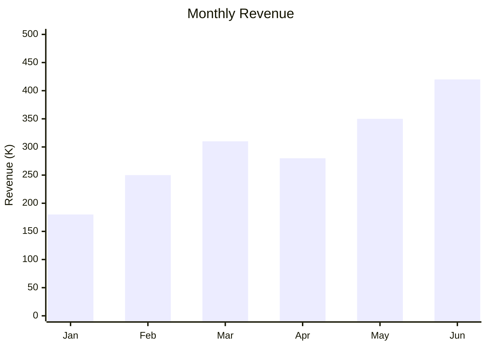

В этом примере:
- title — заголовок диаграммы;
- x-axis — ось X, которая может представлять категории (например, месяцы) или числовой диапазон;
- y-axis — ось Y с числовыми значениями;
- bar — тип диаграммы (столбчатая);
- [data values] — массив числовых данных.

Базовый пример создания линейной диаграммы:

```
xychart-beta
title "User Growth"
x-axis [Jan, Feb, Mar, Apr, May, Jun]
line [1200, 1800, 2500, 3100, 3800, 4500]
```

```mermaid
xychart-beta
title "User Growth"
x-axis [Jan, Feb, Mar, Apr, May, Jun]
line [1200, 1800, 2500, 3100, 3800, 4500]
```

Описание элементов:
- title — заголовок диаграммы, который отображается поверх диаграммы. 
- x-axis — метки для горизонтальной оси. Можно использовать категориальные значения или числовой диапазон.
- y-axis — метка оси Y и её диапазон.
- line — данные для построения линии. Значения должны быть числовыми.

#### Дополнительные возможности
Ориентация диаграммы. По умолчанию диаграмма рисуется вертикально, но можно задать горизонтальное расположение с помощью ключевого слова horizontal. 
Заголовок. Добавляется с помощью ключевого слова title. 
Настройка тем. Цвета элементов диаграммы можно кастомизировать с помощью параметров темы (например, titleColor, backgroundColor, plotColorPalette). 
Несколько рядов данных. Можно добавлять несколько столбчатых или линейных диаграмм, каждая из которых будет иметь уникальный цвет из палитры. 

### Временная шкала (Timeline)
Базовый синтаксис временной линии в Mermaid
Чтобы создать временную линию, нужно начать с ключевого слова timeline. Далее можно добавить заголовок (с помощью ключевого слова title), а затем перечислить временные периоды и события. 

Пример синтаксиса:

```
timeline
    title Project Roadmap
    2025-01 : Kickoff
    2025-03 : Prototype
    2025-06 : Beta
    2025-09 : Launch
```

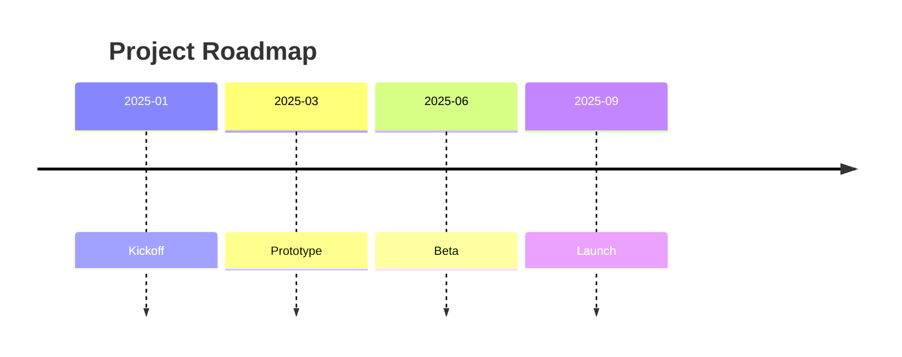

Объяснение элементов:
- timeline — обязательное ключевое слово, указывающее на создание временной линии.
- title — заголовок временной линии, который отображается в верхней части диаграммы.
- YYYY-MM — формат дат событий (четыре цифры года и два месяца). Дни указывать не обязательно.
- После двоеточия указывается описание события — текст, который отображается рядом с точкой на временной линии.
 
Важно: порядок событий в коде не влияет на их расположение — Mermaid автоматически упорядочивает их по хронологии на основе дат. 

```
timeline
    title Case Investigation Timeline
    2023 : Case opened
    2024 : Suspect identified : Evidence collected
    2025 : Trial starts
```

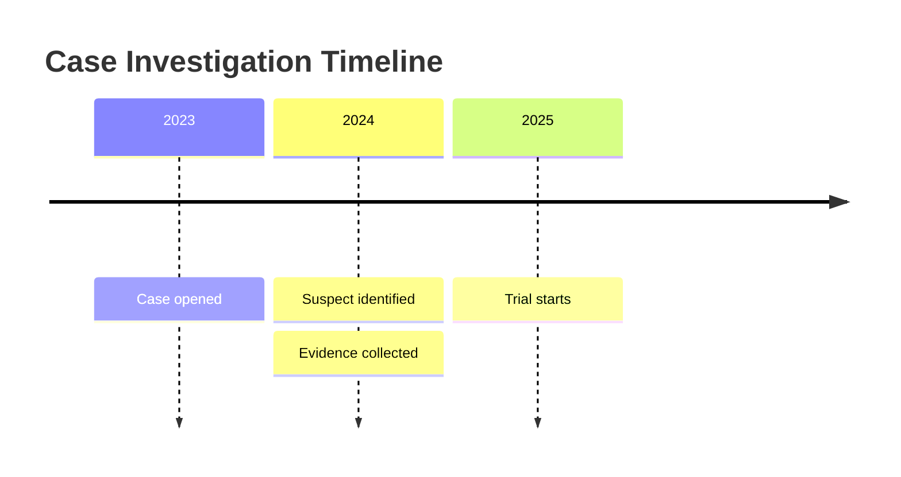

### Диаграмма квадрантов (Quadrant chart)
Квадрантная диаграмма (quadrant chart) в Mermaid — это визуальное представление данных, разделённых на четыре квадранта. Она используется для отображения точек данных на двумерной сетке, где одна переменная представлена по оси X, а другая — по оси Y. Такие диаграммы часто применяют для выявления паттернов и трендов в данных, а также для приоритизации действий на основе положения точек в диаграмме. 

#### Синтаксис квадрантной диаграммы в Mermaid
Базовый синтаксис:

```
quadrantChart
    title                    "Пример квадрантной диаграммы"
    x-axis                   "Левая ось" --> "Правая ось"
    y-axis                   "Нижняя часть --> Верхняя часть"
    quadrant-1               "Квадрант 1 (верхний правый)"
    quadrant-2               "Квадрант 2 (верхний левый)"
    quadrant-3               "Квадрант 3 (нижний левый)"
    quadrant-4               "Квадрант 4 (нижний правый)"
    Point 1: [0.75, 0.80]    %% Точка 1 в верхнем правом квадранте
    Point 2: [0.35, 0.24]    %% Точка 2 в нижнем левом квадранте
```

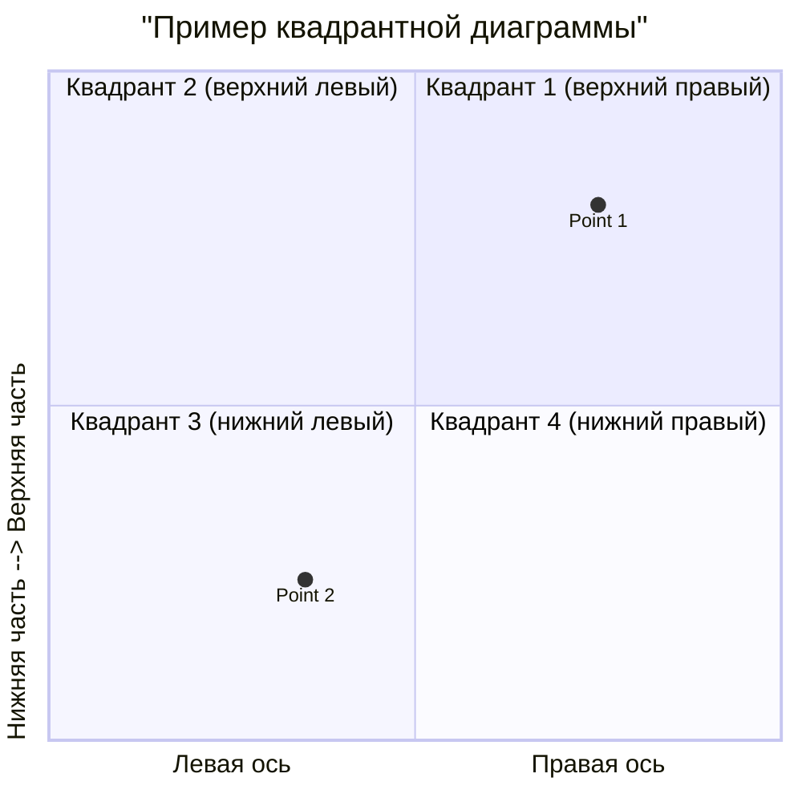

Координаты точек находятся в диапазоне от 0 до 1:
- [0, 0] — нижний левый угол;
- [1, 1] — верхний правый угол;
- [0.5, 0.5] — центр.

Пример кода:

```
quadrantChart
    title                   "Reach and engagement of campaigns"
    x-axis                  "Low Reach --> High Reach"
    y-axis                  "Low Engagement --> High Engagement"
    quadrant-1               "We should expand"
    quadrant-2               "Need to promote"
    quadrant-3               "Re-evaluate"
    quadrant-4               "May be improved"
    Campaign A: [0.3, 0.6]
    Campaign B: [0.45, 0.23]
    Campaign C: [0.57, 0.69]
    Campaign D: [0.78, 0.34]
    Campaign E: [0.40, 0.34]
    Campaign F: [0.35, 0.78]
```

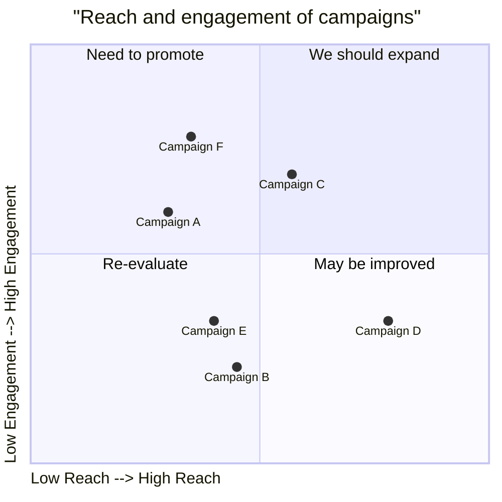

Этот пример демонстрирует диаграмму, которая сравнивает кампании по двум параметрам: охвату и вовлечённости.

#### Дополнительные возможности
Настройка цвета. Можно изменить цвет заливки квадрантов. 

Стилизация точек. Точки можно стилизовать напрямую или с помощью определённых общих классов. 

### Создание трехмерных моделей STL
Синтаксис ASCII STL можно использовать непосредственно в Markdown для создания интерактивных трехмерных моделей. Чтобы отобразить модель, добавьте разметку ASCII STL в блок кода с ограждением, указав идентификатор синтаксиса stl.

Например, можно создать простую трехмерную модель:

```
solid cube_corner
  facet normal 0.0 -1.0 0.0
    outer loop
      vertex 0.0 0.0 0.0
      vertex 1.0 0.0 0.0
      vertex 0.0 0.0 1.0
    endloop
  endfacet
  facet normal 0.0 0.0 -1.0
    outer loop
      vertex 0.0 0.0 0.0
      vertex 0.0 1.0 0.0
      vertex 1.0 0.0 0.0
    endloop
  endfacet
  facet normal -1.0 0.0 0.0
    outer loop
      vertex 0.0 0.0 0.0
      vertex 0.0 0.0 1.0
      vertex 0.0 1.0 0.0
    endloop
  endfacet
  facet normal 0.577 0.577 0.577
    outer loop
      vertex 1.0 0.0 0.0
      vertex 0.0 1.0 0.0
      vertex 0.0 0.0 1.0
    endloop
  endfacet
endsolid
```

```stl
solid cube_corner
  facet normal 0.0 -1.0 0.0
    outer loop
      vertex 0.0 0.0 0.0
      vertex 1.0 0.0 0.0
      vertex 0.0 0.0 1.0
    endloop
  endfacet
  facet normal 0.0 0.0 -1.0
    outer loop
      vertex 0.0 0.0 0.0
      vertex 0.0 1.0 0.0
      vertex 1.0 0.0 0.0
    endloop
  endfacet
  facet normal -1.0 0.0 0.0
    outer loop
      vertex 0.0 0.0 0.0
      vertex 0.0 0.0 1.0
      vertex 0.0 1.0 0.0
    endloop
  endfacet
  facet normal 0.577 0.577 0.577
    outer loop
      vertex 1.0 0.0 0.0
      vertex 0.0 1.0 0.0
      vertex 0.0 0.0 1.0
    endloop
  endfacet
endsolid
```
