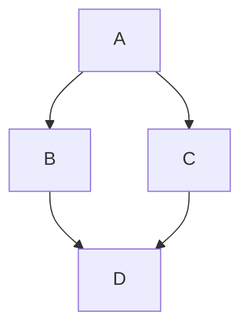
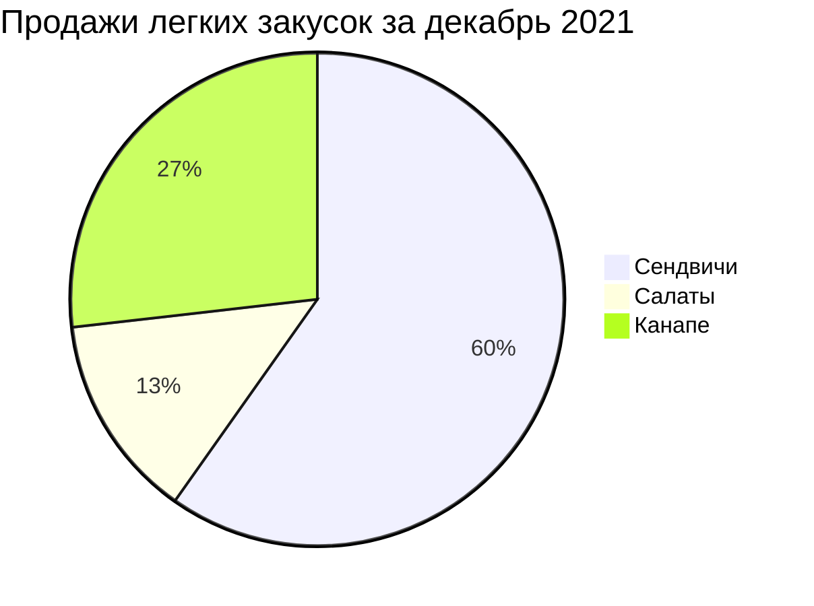
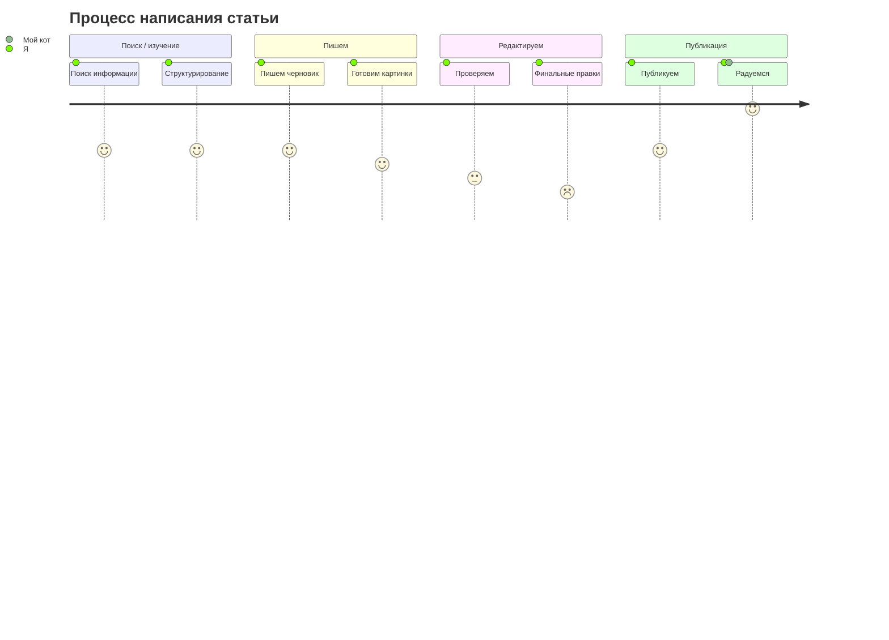
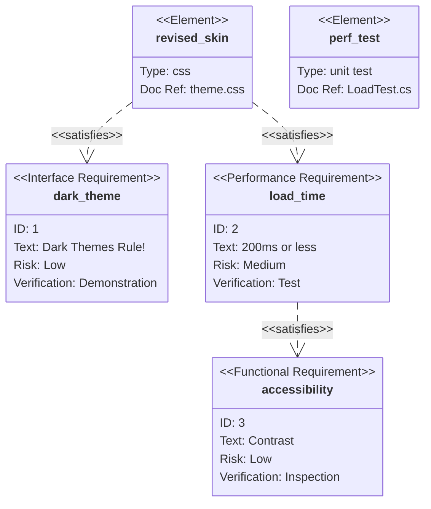
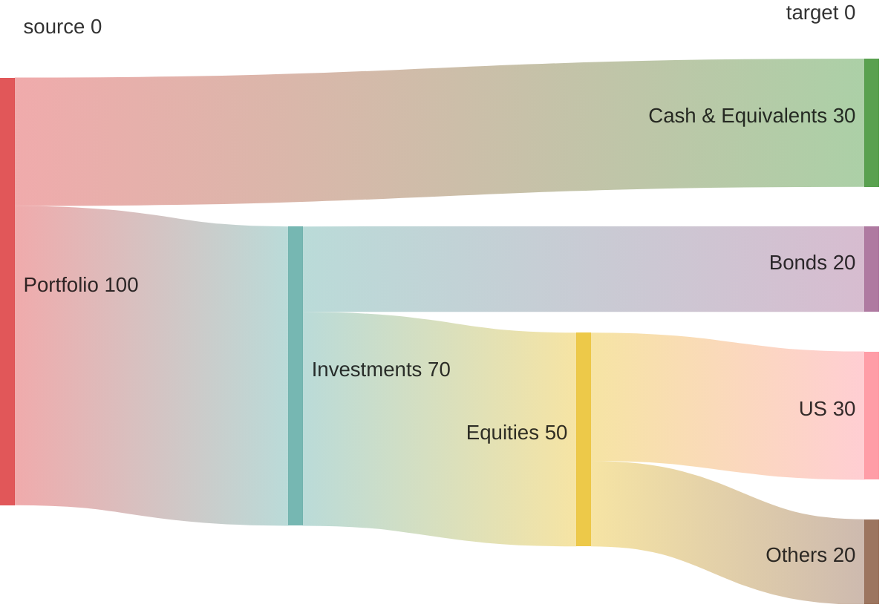

# Диаграммы
## Создание схем mermaid
Mermaid — это инструмент наподобие Markdown, который преобразует текст в схемы. Например, Mermaid может отображать блок-схемы, схемы последовательностей, круговые диаграммы и др. Чтобы создать схему Mermaid, добавьте фрагмент разметки Mermaid в блок кода с ограждением, указав идентификатор языка mermaid.

Например, можно создать блок-диаграмму, указав значения и стрелки.

```
graph TD;
    A-->B;
    A-->C;
    B-->D;
    C-->D;
```



### Проверка версии русалки
Чтобы гарантировать, что GitHub поддерживает синтаксис русалки, проверьте используемую в настоящее время версию mermaid.

```
  info
```

```mermaid
  info
```
### Блок-схема
[см. файл с описанием блок-схем](https://github.com/Shmetroff/test-git/blob/master/flowcharts.md "Блок-схемы")

### Круговые диаграммы
Круговая диаграмма — популярный и простой способ показать какую часть от общего числа занимает отдельные части. В Mermaid круговые диаграммы задаются с помощью ключевого слова pie, далее следует слово title, позволяющее задать название диаграммы и строка с самим названием. Но titlte можно опустить и не использовать, тогда диаграмма будет безымянной.

Данные в диаграмму записываются построчно следующим образом:
- название в кавычках;
- разделитель в виде двоеточия;
- положительное числовое значение (поддерживается до двух знаков после запятой).

```
pie title Продажи легких закусок за декабрь 2021
    "Сендвичи" : 223
    "Салаты" : 50
    "Канапе" : 100
```



### Диаграммы пользовательского пути
С помощью диаграммы пользовательского пути можно продемонстрировать процесс того, как каждый тип пользователя пользуется мобильным или веб приложением. Для создания подобных схем в Mermaid есть ключевое слово journey, title также отвечает за название всей диаграммы. С помощью section можно задавать разделы. В каждом разделе указываются конкретные шаги с оценкой по десятибалльной шкале и закрепленным за действием лицом. Все эти данные следует вводить через разделитель в виде двоеточия.

```
journey
    title Процесс написания статьи
    section Поиск / изучение
      Поиск информации: 5: Я
      Структурирование: 5: Я
    section Пишем
      Пишем черновик: 5: Я
      Готовим картинки: 4: Я
    section Редактируем
        Проверяем: 3: Я
        Финальные правки: 2: Я
    section Публикация
        Публикуем: 5: Я
        Радуемся: 8: Я, Мой кот
```



### Диаграмма Ганта
[см. файл с описанием диаграмм Ганта](https://github.com/Shmetroff/test-git/blob/master/ganttcharts.md "Диаграммы Ганта")

### UML-диаграммы
[см. файл с описанием UML-диаграмм](https://github.com/Shmetroff/test-git/blob/master/classcharts.md "UML-диаграммы")

### Диаграмма состояния
[см. файл с описанием диаграмм состояния](https://github.com/Shmetroff/test-git/blob/master/statecharts.md "Диаграммы состояния")

### ER-модель
[см. файл с описанием ER-диаграмм](https://github.com/Shmetroff/test-git/blob/master/ercharts.md "ER-диаграммы")

### Диаграммы последовательности
[см. файл с описанием диаграмм последовательности](https://github.com/Shmetroff/test-git/blob/master/seqcharts.md "Диаграммы последовательности")

### Диаграмма Gitgraph (Git): Визуализирует ветки и коммиты Git
[см. файл с описанием диаграмм Gitgraph](https://github.com/Shmetroff/test-git/blob/master/gitgraphs.md "Диаграммы Gitgraph")

### Карты мыслей (Mindmaps)
[см. файл с описанием Mindmaps диаграмм](https://github.com/Shmetroff/test-git/blob/master/mindmaps.md "Диаграммы Mindmaps")

### Диаграмма требований (Requirement Diagram)
Это визуальное представление требований к системе, их связей с другими элементами и документированными данными. Такие диаграммы следуют стандартам SysML v1.6 и помогают наглядно отобразить зависимости, риски и методы проверки.

#### Основные компоненты диаграммы требований
В диаграмме требований есть три типа компонентов:
- Требования — определяют требования с атрибутами (тип, ID, текст, риск, метод проверки).
- Элементы — связаны с требованиями, могут иметь тип и ссылку на документ.
- Отношения — определяют связи между требованиями и элементами или между несколькими требованиями.
 
Синтаксис определения требования:
```
<type> user_defined_name {
    id: user_defined_id
    text: user-defined text
    risk: <risk>
    verifymethod: <method>
}
```

Возможные типы требований: requirement, functionalRequirement, interfaceRequirement, performanceRequirement, physicalRequirement, designConstraint. 

Примеры значений для risk: Low, Medium, High. Для verifymethod — Analysis, Inspection, Test, Demonstration. 

Пример диаграммы с несколькими требованиями и элементами:

```
requirementDiagram

interfaceRequirement dark_theme {
    id: 1
    text: Dark Themes Rule!
    risk: low
    verifymethod: demonstration
}

performanceRequirement load_time {
    id: 2
    text: 200ms or less
    risk: medium
    verifymethod: test
}

functionalRequirement accessibility {
    id: 3
    text: Contrast
    risk: low
    verifymethod: inspection
}

element revised_skin {
    type: css
    docRef: theme.css
}

element perf_test {
    type: unit test
    docRef: LoadTest.cs
}

revised_skin - satisfies -> dark_theme
revised_skin - satisfies -> load_time
load_time - satisfies -> accessibility
```



Типы отношений между элементами:
- contains;
- copies;
- derives;
- satisfies;
- verifies;
- refines;
- traces.

### Диаграмма C4 (архитектура)
[см. файл с описанием диаграмм C4](https://github.com/Shmetroff/test-git/blob/master/c4charts.md "Диаграммы C4")

### Диаграмма потоков (Sankey Diagram)
Sankey-диаграмма в Mermaid — это визуализация потока данных между узлами, где ширина связи пропорциональна величине потока. Такие диаграммы часто используют для отображения распределения энергии, ресурсов, финансовых потоков или пользовательских путей.

#### Базовый синтаксис
Диаграмма начинается с ключевого слова sankey-beta, за которым следуют данные в формате CSV с тремя столбцами: source (исходный узел), target (целевой узел), value (величина потока). 

Пример кода:

```
sankey-beta
source, target, value
Portfolio, Investments, 70
Portfolio, Cash & Equivalents, 30
Investments, Equities, 50
Investments, Bonds, 20
Equities, US, 30
Equities, Others, 20
```



#### Особенности синтаксиса
Пустые строки. В отличие от стандартного CSV, в Mermaid можно использовать пустые строки для лучшей визуальной организации.
Запятые в метках узлов. Если в метке узла есть запятая, её нужно заключить в двойные кавычки.
Двойные кавычки в метках. Чтобы включить двойные кавычки в метку узла, используйте две двойные кавычки внутри кавычек.

Можно настраивать внешний вид диаграммы с помощью параметров. Цвета связей. linkColor может быть:
- source — цвет связи соответствует цвету исходного узла;
- target — цвет связи соответствует цвету целевого узла;
- gradient — плавный переход между цветами исходного и целевого узлов;
- шестнадцатеричный код цвета (например, #a1a1a1).

Выравнивание узлов. nodeAlignment может быть justify (распределение узлов равномерно), center (центральное выравнивание), left (выравнивание по левому краю), right (выравнивание по правому краю).

Размеры диаграммы. Можно задать ширину и высоту с помощью параметров width и height.

### Графики по осям X и Y (XYChart)
[см. файл с описанием XYChart диаграмм](https://github.com/Shmetroff/test-git/blob/master/xycharts.md "Диаграммы XYChart")

### Временная шкала (Timeline)
[см. файл с описанием Timeline диаграмм](https://github.com/Shmetroff/test-git/blob/master/timelines.md "Диаграммы Timeline")

### Диаграмма квадрантов (Quadrant chart)
[см. файл с описанием Quadrant диаграмм](https://github.com/Shmetroff/test-git/blob/master/quadrantcharts.md "Диаграммы Quadrant")

### Создание трехмерных моделей STL
Синтаксис ASCII STL можно использовать непосредственно в Markdown для создания интерактивных трехмерных моделей. Чтобы отобразить модель, добавьте разметку ASCII STL в блок кода с ограждением, указав идентификатор синтаксиса stl.

Например, можно создать простую трехмерную модель:

```
solid cube_corner
  facet normal 0.0 -1.0 0.0
    outer loop
      vertex 0.0 0.0 0.0
      vertex 1.0 0.0 0.0
      vertex 0.0 0.0 1.0
    endloop
  endfacet
  facet normal 0.0 0.0 -1.0
    outer loop
      vertex 0.0 0.0 0.0
      vertex 0.0 1.0 0.0
      vertex 1.0 0.0 0.0
    endloop
  endfacet
  facet normal -1.0 0.0 0.0
    outer loop
      vertex 0.0 0.0 0.0
      vertex 0.0 0.0 1.0
      vertex 0.0 1.0 0.0
    endloop
  endfacet
  facet normal 0.577 0.577 0.577
    outer loop
      vertex 1.0 0.0 0.0
      vertex 0.0 1.0 0.0
      vertex 0.0 0.0 1.0
    endloop
  endfacet
endsolid
```

```stl
solid cube_corner
  facet normal 0.0 -1.0 0.0
    outer loop
      vertex 0.0 0.0 0.0
      vertex 1.0 0.0 0.0
      vertex 0.0 0.0 1.0
    endloop
  endfacet
  facet normal 0.0 0.0 -1.0
    outer loop
      vertex 0.0 0.0 0.0
      vertex 0.0 1.0 0.0
      vertex 1.0 0.0 0.0
    endloop
  endfacet
  facet normal -1.0 0.0 0.0
    outer loop
      vertex 0.0 0.0 0.0
      vertex 0.0 0.0 1.0
      vertex 0.0 1.0 0.0
    endloop
  endfacet
  facet normal 0.577 0.577 0.577
    outer loop
      vertex 1.0 0.0 0.0
      vertex 0.0 1.0 0.0
      vertex 0.0 0.0 1.0
    endloop
  endfacet
endsolid
```
