# Диаграммы
## Создание схем mermaid
Mermaid — это инструмент наподобие Markdown, который преобразует текст в схемы. Например, Mermaid может отображать блок-схемы, схемы последовательностей, круговые диаграммы и др. Чтобы создать схему Mermaid, добавьте фрагмент разметки Mermaid в блок кода с ограждением, указав идентификатор языка mermaid.

Например, можно создать блок-диаграмму, указав значения и стрелки.

```
graph TD;
    A-->B;
    A-->C;
    B-->D;
    C-->D;
```

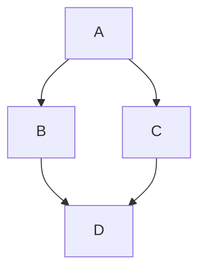

### Проверка версии русалки
Чтобы гарантировать, что GitHub поддерживает синтаксис русалки, проверьте используемую в настоящее время версию mermaid.

```
  info
```

```mermaid
  info
```
### Блок-схема
[см. файл с описанием блок-схем](https://github.com/Shmetroff/test-git/blob/master/flowcharts.md "Блок-схемы")

### UML-диаграммы
UML-диаграммы обычно используются для схематичного отображения классов и их связей в коде. Mermaid позволяет создавать диаграммы классов с помощью ключевого слова classDiagram. Каждый экземпляр класса содержит в себе три составляющие:
- в верхней части располагается название класса и необязательное описание;
- в центральной части находятся атрибуты класса, которые указываются со строчной буквы и выравниваются по левому краю;
- в нижней части размещены методы класса.

Есть два способа задать поля класса. Результаты рендеринга одинаковые, но второй способ занимает меньше места и требует меньше кода:

```
classDiagram
    class BankAccount
    BankAccount : +String owner
    BankAccount : +Bigdecimal balance
    BankAccount : +deposit(amount)
    BankAccount : +withdrawl(amount)
```

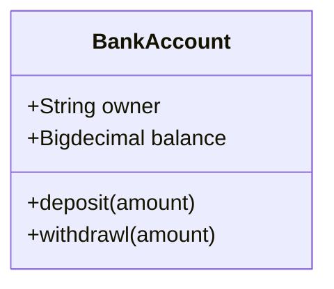

Или

```
classDiagram
class BankAccount{
    +String owner
    +BigDecimal balance
    +deposit(amount)
    +withdrawl(amount)
}
```

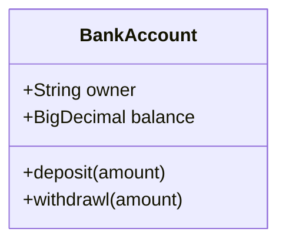

Модификаторы доступа полей класса условно задаются с помощью символов перед самим полем:
- \+ — public;
- \- — private;
- \# — protected;
- \~ — package.

Отношения между классами задаются с помощью различных видов стрелок, общая модель выглядит следующим образом:
	[класс][стрелка][класс]
|Тип|Описание|
|-|-|
|<\|--|Наследование|
|*--|Композиция|
|o--|Агрегация|
|-->|Ассоциация|
|--|Ссылка (сплошная)
|..>|Зависимость|
|..\|>|Реализация|
|..|Ссылка (пунктирная)|

```
classDiagram
classA <|-- classB
classC *-- classD
classE o-- classF
classG <-- classH
classI -- classJ
classK <.. classL
classM <|.. classN
classO .. classP
```

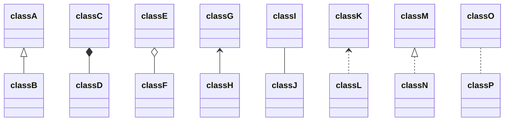

При желании можно явно указать вид связи в виде текста:
	classE --o classF : Агрегация

Двусторонние отношения задаются с помощью дублированной стрелки, направленной в обе стороны:

```
classDiagram
    Animal <|--|> Zebra
```

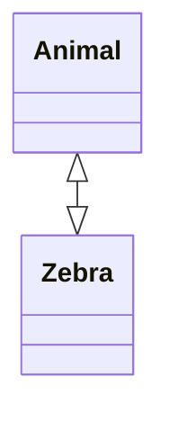

Всего двусторонние отношения возможны для следующих видов взаимоотношений:

|Тип|Описание|
|-|-|
|<\||Наследование|
|*|Композиция|
|o|Агрегация|
|>|Ассоциация|
|<|Ассоциация|
||>|Реализация|

Всего поддерживаются следующие типы множественного наследования:
- 1 — только один;
- 0..1 — ноль или один;
- 1..* — один или больше;
- \* — много;
- n — n-ое количество;
- 0..n — от нуля до n;
- 1..n — от единицы до n.

Задается множественное наследование следующим образом:

```
classDiagram
    Customer "1" --> "*" Ticket
    Student "1" --> "1..*" Course
    Galaxy --> "many" Star : Contains
```

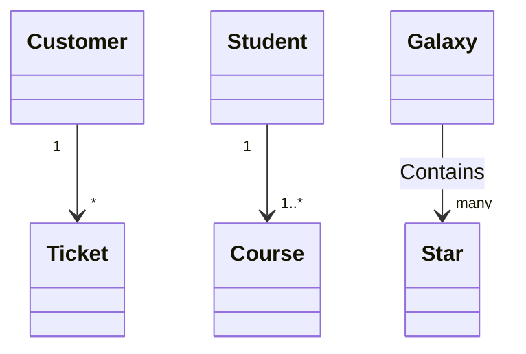

Классы можно аннотировать с помощью специальных маркеров, содержимое которых отображается в блоке с названием. Возможны 4 вида аннотаций:
- <<Interface>> — интерфейсы;
- <<abstract>> — абстрактный класс;
- <<Service>> — классы-сервисы;
- <<enumeration>> — перечисления с областью видимости.

Задать можно также двумя разными способами, которые не влияют на результаты рендеринга:

```
classDiagram
class Shape
<<interface>> Shape
Shape : noOfVertices
Shape : draw()
```

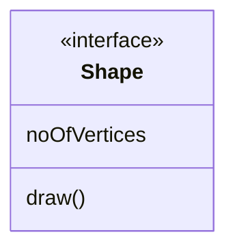

Или

```
class ShapeCopy {
    <<interface>>
    noOfVertices
    draw()
}
```

```mermaid
class ShapeCopy {
    <<interface>>
    noOfVertices
    draw()
}
```

UML-диаграммам так же как и блок-схемам можно задавать направление. Оператор направления следует указывать после ключевого слова direction.

```
classDiagram
  direction LR
  class Student {
    -idCard : IdCard
  }

  class IdCard{
    -id : int
    -name : string
  }

 Student "1" --o "1" IdCard : carries
```

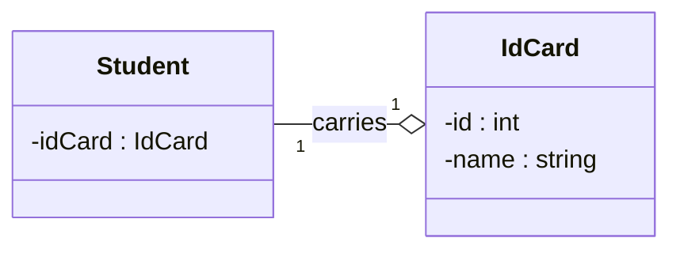

Класс UML-схемы может содержать в себе ссылку и быть кликабельным. Задается все таким же образом, как и в блок-схемах:

```
classDiagram
  direction LR
  class Student {
    -idCard : IdCard
  }
link Student "http://www.github.com"
```

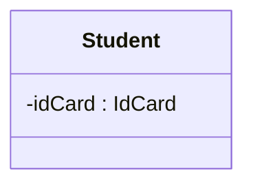

### Круговые диаграммы
Круговая диаграмма — популярный и простой способ показать какую часть от общего числа занимает отдельные части. В Mermaid круговые диаграммы задаются с помощью ключевого слова pie, далее следует слово title, позволяющее задать название диаграммы и строка с самим названием. Но titlte можно опустить и не использовать, тогда диаграмма будет безымянной.

Данные в диаграмму записываются построчно следующим образом:
- название в кавычках;
- разделитель в виде двоеточия;
- положительное числовое значение (поддерживается до двух знаков после запятой).

```
pie title Продажи легких закусок за декабрь 2021
    "Сендвичи" : 223
    "Салаты" : 50
    "Канапе" : 100
```

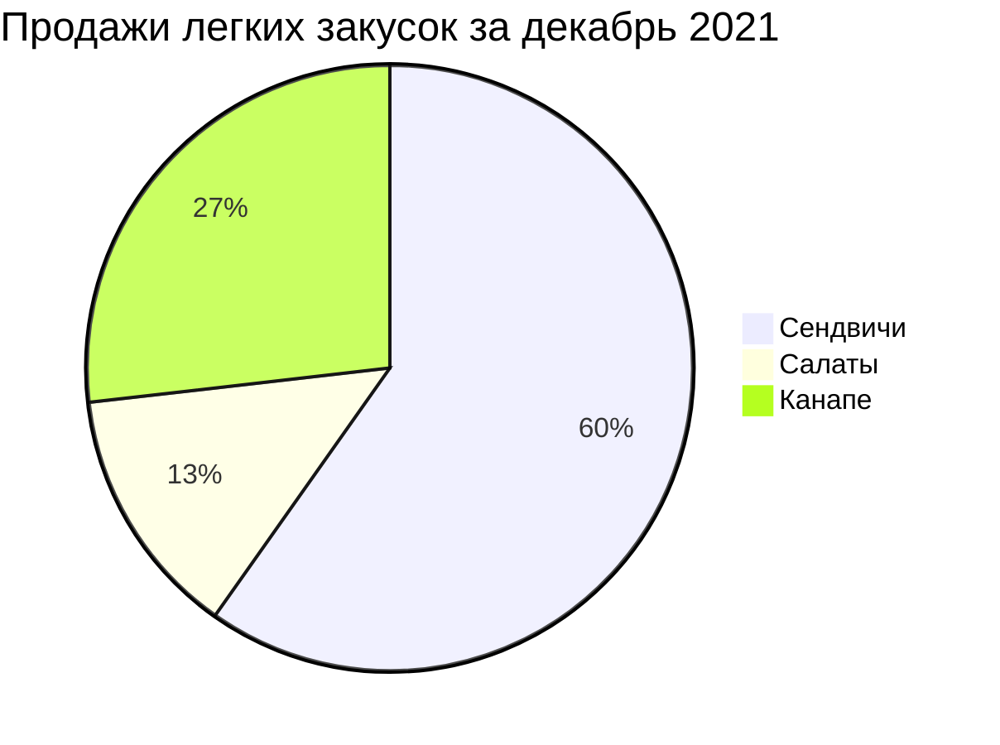

### Диаграммы пользовательского пути
С помощью диаграммы пользовательского пути можно продемонстрировать процесс того, как каждый тип пользователя пользуется мобильным или веб приложением. Для создания подобных схем в Mermaid есть ключевое слово journey, title также отвечает за название всей диаграммы. С помощью section можно задавать разделы. В каждом разделе указываются конкретные шаги с оценкой по десятибалльной шкале и закрепленным за действием лицом. Все эти данные следует вводить через разделитель в виде двоеточия.

```
journey
    title Процесс написания статьи
    section Поиск / изучение
      Поиск информации: 5: Я
      Структурирование: 5: Я
    section Пишем
      Пишем черновик: 5: Я
      Готовим картинки: 4: Я
    section Редактируем
        Проверяем: 3: Я
        Финальные правки: 2: Я
    section Публикация
        Публикуем: 5: Я
        Радуемся: 8: Я, Мой кот
```

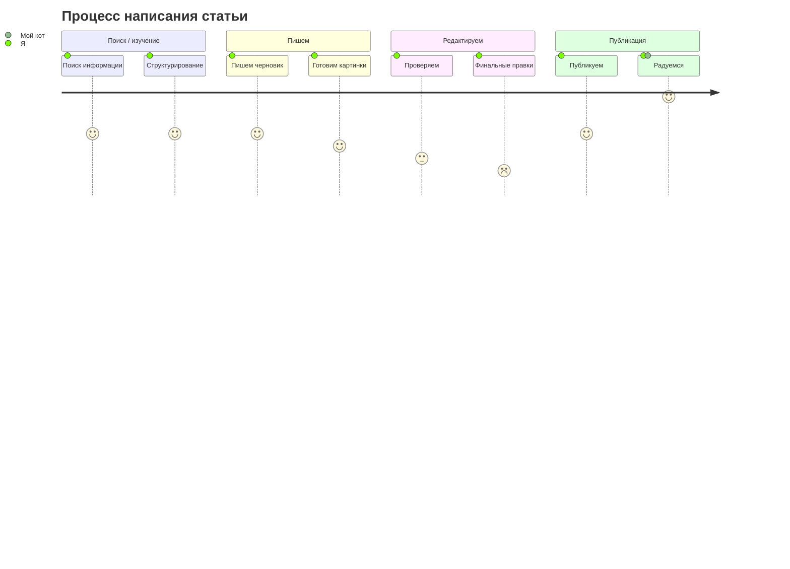

### Диаграмма Ганта
Диаграмма Ганта часто применяется в приложениях для планирования и отображает процесс работы над проектом. Обычно такая диаграмма состоит из двух основных частей — временной шкалы и задач. Подобные виды отслеживания задач довольно популярны и первую версию придумали аж в 1910 году, поэтому за более чем сотню лет появились альтернативные и расширенные виды. Но у всех вариантов всегда одна и таже задача. 

В Mermaid диаграммы Ганта состоят из двух частей — на оси X находится шкала времени, а на оси Y задачи и порядок их выполнения. Такой вид диаграммы задается ключевым словом gantt, в title вписывается название. Далее следует указать формат даты, который система будет принимать для рендеринга итоговой диаграммы (dateFormat). Разделы по оси Y задаются с помощью ключевого слова section и названия раздела. А далее следует указывать сами задачи, которые состоят из короткого текста задачи, имени, даты начала и продолжительности. При этом текст задачи располагается с левой части, а остальные параметры с правой и разделяются запятой. Через ключевое слово after можно явно указать последовательность задач в рамках раздела, если этого не сделать, то система сама расположит их по порядку.

```
gantt
    title Диаграмма Ганта
    dateFormat  YYYY-MM-DD
    section Секция 1
    Задача 1         :a1, 2014-01-01, 15d
    Задача 2         :20d
    section Секция 2
    Задача 1         :2014-01-12  , 12d
    Задача 2         : 24d
```

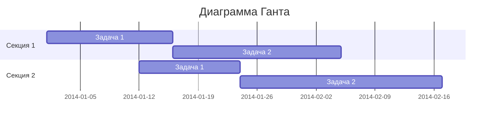

Для каждой задачи существуют несколько параметров, которые указывают на ее состояние:
- crit — особенно важные задачи;
- active — задачи в работе;
- done — выполненные задачи;
- milestone — вехи (единичные важные события).

```
gantt
    title Диаграмма Ганта
    dateFormat  YYYY-MM-DD
    section Секция 1
    Milestone   :milestone, a1, 2014-01-01, 15d
    Crit        :crit, a2, 2014-01-01, 15d 
    Active      :active, a3, 2014-01-01, 15d
    Done        :done, a4, 2014-01-01, 15d
```

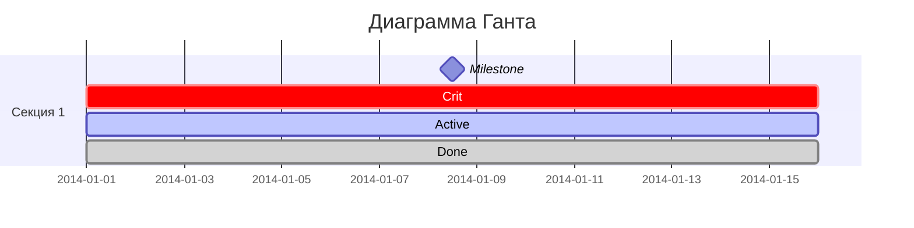

### Создание трехмерных моделей STL
Синтаксис ASCII STL можно использовать непосредственно в Markdown для создания интерактивных трехмерных моделей. Чтобы отобразить модель, добавьте разметку ASCII STL в блок кода с ограждением, указав идентификатор синтаксиса stl.

Например, можно создать простую трехмерную модель:

```
solid cube_corner
  facet normal 0.0 -1.0 0.0
    outer loop
      vertex 0.0 0.0 0.0
      vertex 1.0 0.0 0.0
      vertex 0.0 0.0 1.0
    endloop
  endfacet
  facet normal 0.0 0.0 -1.0
    outer loop
      vertex 0.0 0.0 0.0
      vertex 0.0 1.0 0.0
      vertex 1.0 0.0 0.0
    endloop
  endfacet
  facet normal -1.0 0.0 0.0
    outer loop
      vertex 0.0 0.0 0.0
      vertex 0.0 0.0 1.0
      vertex 0.0 1.0 0.0
    endloop
  endfacet
  facet normal 0.577 0.577 0.577
    outer loop
      vertex 1.0 0.0 0.0
      vertex 0.0 1.0 0.0
      vertex 0.0 0.0 1.0
    endloop
  endfacet
endsolid
```

```stl
solid cube_corner
  facet normal 0.0 -1.0 0.0
    outer loop
      vertex 0.0 0.0 0.0
      vertex 1.0 0.0 0.0
      vertex 0.0 0.0 1.0
    endloop
  endfacet
  facet normal 0.0 0.0 -1.0
    outer loop
      vertex 0.0 0.0 0.0
      vertex 0.0 1.0 0.0
      vertex 1.0 0.0 0.0
    endloop
  endfacet
  facet normal -1.0 0.0 0.0
    outer loop
      vertex 0.0 0.0 0.0
      vertex 0.0 0.0 1.0
      vertex 0.0 1.0 0.0
    endloop
  endfacet
  facet normal 0.577 0.577 0.577
    outer loop
      vertex 1.0 0.0 0.0
      vertex 0.0 1.0 0.0
      vertex 0.0 0.0 1.0
    endloop
  endfacet
endsolid
```
