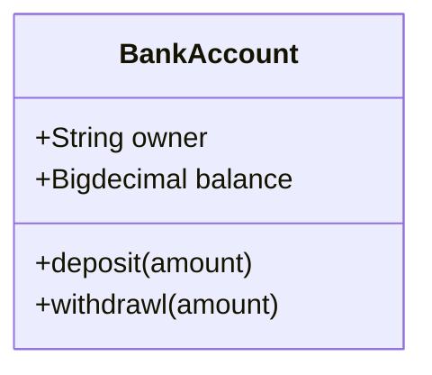
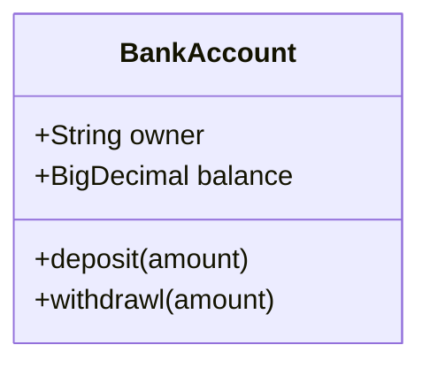
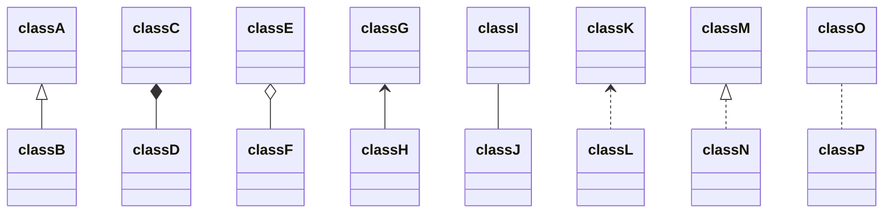
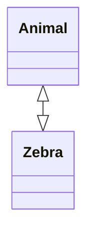
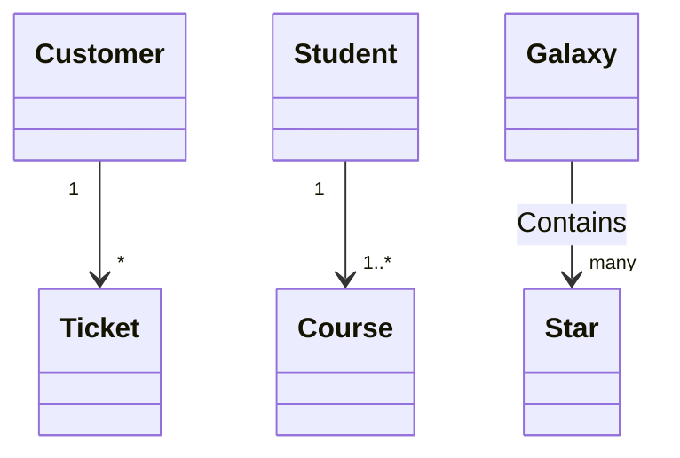
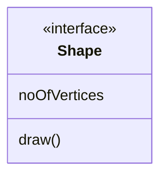
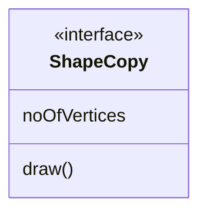
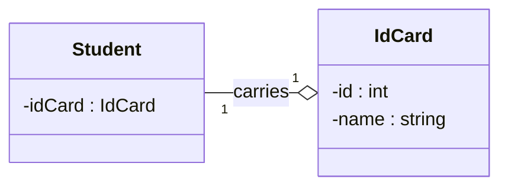

# UML-диаграммы
UML-диаграммы обычно используются для схематичного отображения классов и их связей в коде. Mermaid позволяет создавать диаграммы классов с помощью ключевого слова classDiagram. Каждый экземпляр класса содержит в себе три составляющие:
- в верхней части располагается название класса и необязательное описание;
- в центральной части находятся атрибуты класса, которые указываются со строчной буквы и выравниваются по левому краю;
- в нижней части размещены методы класса.

## Поля и методы
Есть два способа задать поля класса. Результаты рендеринга одинаковые, но второй способ занимает меньше места и требует меньше кода:

```
classDiagram
    class BankAccount
    BankAccount : +String owner
    BankAccount : +Bigdecimal balance
    BankAccount : +deposit(amount)
    BankAccount : +withdrawl(amount)
```



Или

```
classDiagram
class BankAccount{
    +String owner
    +BigDecimal balance
    +deposit(amount)
    +withdrawl(amount)
}
```



### Модификаторы доступа
Модификаторы доступа полей класса условно задаются с помощью символов перед самим полем:
- \+ — public;
- \- — private;
- \# — protected;
- \~ — package.

## Отношения между классами
Отношения между классами задаются с помощью различных видов стрелок, общая модель выглядит следующим образом:
`[класс][стрелка][класс]`
|Тип|Описание|
|-|-|
|<\|--|Наследование|
|*--|Композиция|
|o--|Агрегация|
|-->|Ассоциация|
|--|Ссылка (сплошная)
|..>|Зависимость|
|..\|>|Реализация|
|..|Ссылка (пунктирная)|

```
classDiagram
classA <|-- classB
classC *-- classD
classE o-- classF
classG <-- classH
classI -- classJ
classK <.. classL
classM <|.. classN
classO .. classP
```



При желании можно явно указать вид связи в виде текста:
	classE --o classF : Агрегация

Двусторонние отношения задаются с помощью дублированной стрелки, направленной в обе стороны:

```
classDiagram
    Animal <|--|> Zebra
```



Всего двусторонние отношения возможны для следующих видов взаимоотношений:

|Тип|Описание|
|-|-|
|<\||Наследование|
|*|Композиция|
|o|Агрегация|
|>|Ассоциация|
|<|Ассоциация|
|\|>|Реализация|

Всего поддерживаются следующие типы множественного наследования:
- 1 — только один;
- 0..1 — ноль или один;
- 1..* — один или больше;
- \* — много;
- n — n-ое количество;
- 0..n — от нуля до n;
- 1..n — от единицы до n.

Задается множественное наследование следующим образом:

```
classDiagram
    Customer "1" --> "*" Ticket
    Student "1" --> "1..*" Course
    Galaxy --> "many" Star : Contains
```



## Аннотации
Классы можно аннотировать с помощью специальных маркеров, содержимое которых отображается в блоке с названием. Возможны 4 вида аннотаций:
- <<Interface>> — интерфейсы;
- <<abstract>> — абстрактный класс;
- <<Service>> — классы-сервисы;
- <<enumeration>> — перечисления с областью видимости.

Задать можно также двумя разными способами, которые не влияют на результаты рендеринга:

```
classDiagram
class Shape
<<interface>> Shape
Shape : noOfVertices
Shape : draw()
```



Или

```
classDiagram
class ShapeCopy {
    <<interface>>
    noOfVertices
    draw()
}
```



## Направление диаграммы
UML-диаграммам так же как и блок-схемам можно задавать направление. Оператор направления следует указывать после ключевого слова direction ([см. файл с описанием блок-схем](https://github.com/Shmetroff/test-git/blob/master/flowcharts.md "Блок-схемы"), там указаны все возмоные направления).

```
classDiagram
  direction LR
  class Student {
    -idCard : IdCard
  }

  class IdCard{
    -id : int
    -name : string
  }

 Student "1" --o "1" IdCard : carries
```



## Ссылки (не работает в GitHib)
Класс UML-схемы может содержать в себе ссылку и быть кликабельным. Задается все таким же образом, как и в блок-схемах ([см. файл с описанием блок-схем](https://github.com/Shmetroff/test-git/blob/master/flowcharts.md "Блок-схемы"), содержит полное описание как использовать ссылки или вызывать JavaScript функции):

```
classDiagram
  direction LR
  class Student {
    -idCard : IdCard
  }
link Student "http://www.github.com"
```

**Но это не работает в GitHub из-за ограничений по безопасности, только JavaScript!**
