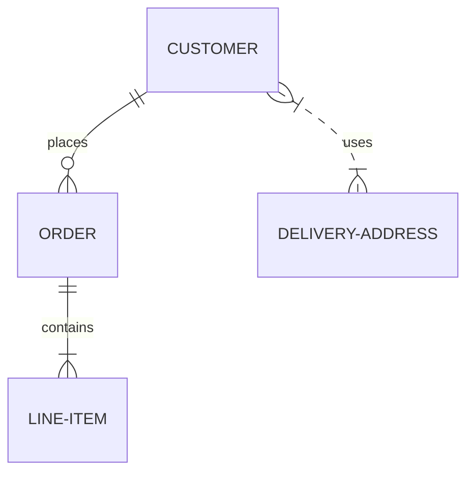
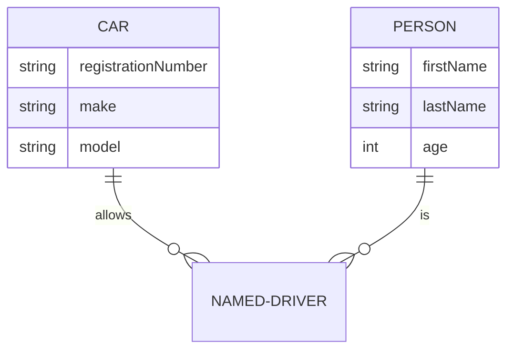
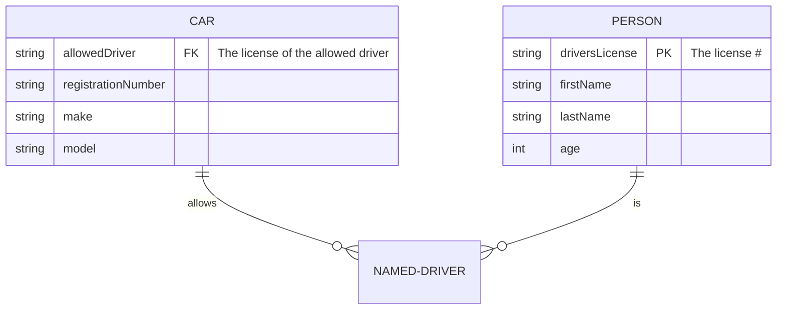

# ER-модель
ER-модель — модель данных, описывающая взаимосвязанные вещи, представляющие интерес в определенной области знаний. Зачастую используется при высокоуровневом проектировании баз данных. Задается с помощью ключевого слова erDiagram.

```
erDiagram
    CUSTOMER ||--o{ ORDER : places
    ORDER ||--|{ LINE-ITEM : contains
    CUSTOMER }|..|{ DELIVERY-ADDRESS : uses
```



## Сущности
Mermaid не требует указывать имена сущностей с заглавной буквы, а связи обозначаются популярной нотацией «гусиные лапки».

### Связи
Отношения задаются с помощью следующей базовой конструкцией:

`<first-entity> [<relationship> <second-entity> : <relationship-label>]`

- first-entity — имя сущности;
- relationship — описания способа связи;
- second-entity — имя другой сущности;
- relationship-label — описание отношения с точки зрения первой сущности.

К примеру:

`PROPERTY ||--|{ ROOM : contains`

|Значение слева|Значение справа|Значение|
|-|-|-|
|\|o|o\||Минимум ноль, максимум ноль|
|\|\||\|\||Минимум один, максимум один|
|}o|o{|Минимум ноль, максимум много|
|}\||\|{|Минимум один, максимум много|

### Атрибуты
Атрибуты сущностей обозначаются после имени самой сущности. Также существует два вида записи.

```
erDiagram
    CAR ||--o{ NAMED-DRIVER : allows
    CAR {
        string registrationNumber
        string make
        string model
    }
    PERSON ||--o{ NAMED-DRIVER : is
    PERSON {
        string firstName
        string lastName
        int age
    }
```



#### Ключи и комментарии
Атрибуты могут иметь ключи или комментарии. Первичные ключи (Primary Key) обозначаются как PR, а внешние ключи (Foreign Key) FK. Комментарий же определяется двойными кавычками в конце атрибута. При этом комментарий не может содержать в себе двойные кавычки.

```
erDiagram
    CAR ||--o{ NAMED-DRIVER : allows
    CAR {
        string allowedDriver FK "The license of the allowed driver"
        string registrationNumber
        string make
        string model
    }
    PERSON ||--o{ NAMED-DRIVER : is
    PERSON {
        string driversLicense PK "The license #"
        string firstName
        string lastName
        int age
    }
```


