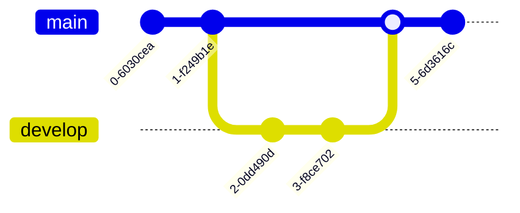
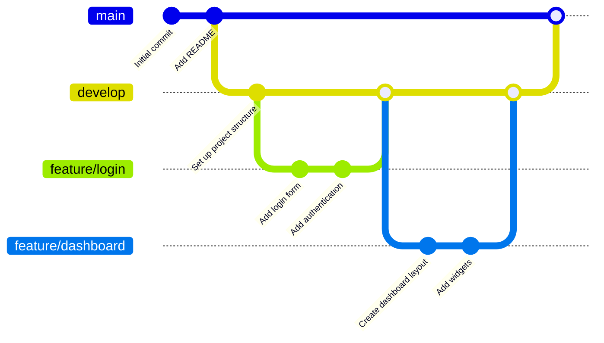

# Диаграмма Gitgraph (Git): Визуализирует ветки и коммиты Git
С его помощью можно наглядно отобразить историю репозитория, включая коммиты, ветки и слияния. 

## Базовый синтаксис
Основные команды для создания GitGraph в Mermaid:
- commit — добавляет новый коммит в текущую ветку;
- branch [name] — создаёт новую ветку и переключается на неё;
- checkout [branch] — переключается на существующую ветку;
- merge [branch] — сливает указанную ветку в текущую. 
Можно также использовать команду cherry-pick [id] для выбора конкретного коммита.

Пример базового GitGraph:

```
gitGraph
  commit
  commit
  branch develop
  checkout develop
  commit
  commit
  checkout main
  merge develop
  commit
```



В этом примере:
- Созданы два коммита в ветке main.
- Создана ветка develop и переключены на неё.
- В ветке develop сделано два коммита.
- Переключились обратно на main.
- Ветка develop слита в main.
- В main сделан ещё один коммит. 

Расширенный пример.

Пример, демонстрирующий рабочий процесс разработки функций:

```
gitGraph
  commit id: "Initial commit"
  commit id: "Add README"
  branch develop
  checkout develop
  commit id: "Set up project structure"
  branch feature/login
  checkout feature/login
  commit id: "Add login form"
  commit id: "Add authentication"
  checkout develop
  merge feature/login
  branch feature/dashboard
  checkout feature/dashboard
  commit id: "Create dashboard layout"
  commit id: "Add widgets"
  checkout develop
  merge feature/dashboard
  checkout main
  merge develop
```



Здесь показано создание основной ветки, развитие функций в отдельных ветках (feature/login, feature/dashboard), их слияние в develop, а затем в main. 

## Дополнительные возможности
Пользовательские ID для коммитов. Можно задать собственный ID для коммита с помощью атрибута id: "ваш_ID".

Типы коммитов. Можно указывать тип коммита (например, NORMAL, REVERSE, HIGHLIGHT).

Теги и релизы. Для добавления тегов используется tag: "название_тега".

Ориентация графика. По умолчанию график строится слева направо. Можно изменить ориентацию, добавив после gitGraph ключевое слово: LR (слева направо, по умолчанию), TB (сверху вниз), BT (снизу вверх).

Можно управлять отображением веток (showBranches), меток коммитов (showCommitLabel), названием основной ветки (mainBranchName) и другими параметрами. 
