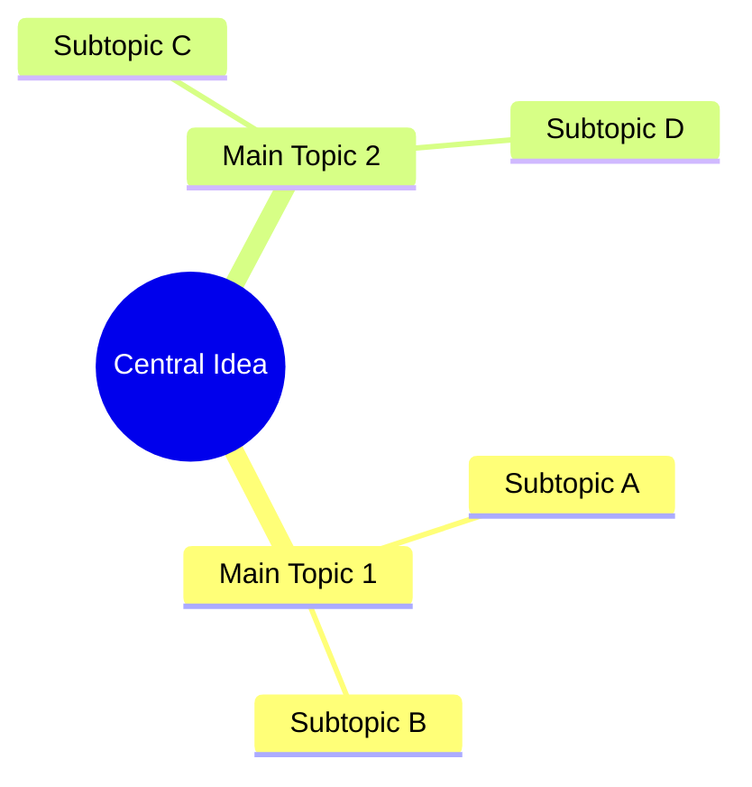
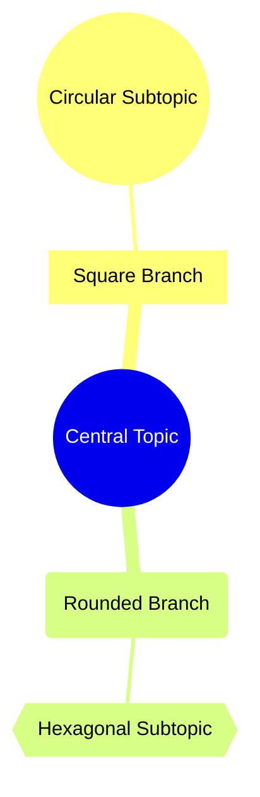
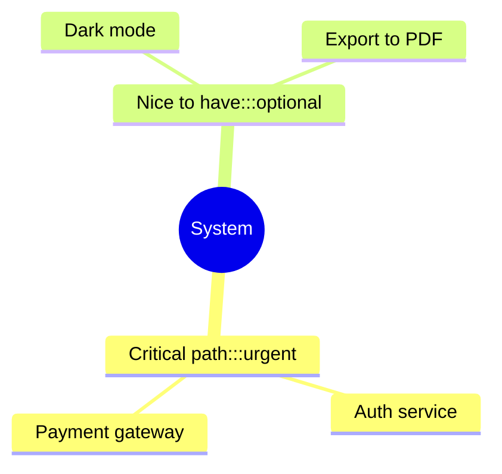
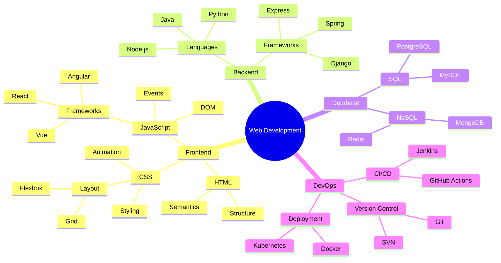

# Карты мыслей (Mindmaps)
Синтаксис основан на отступах для определения уровней иерархии, а узлы могут иметь разные формы и иконки. 

## Базовый синтаксис
Ментальная карта начинается с ключевого слова mindmap. Корневой узел (центральная идея) указывается после него. Дочерние узлы создаются с помощью отступов. 

Пример простой ментальной карты:

```
mindmap
root((Central Idea))
    Main Topic 1
        Subtopic A
        Subtopic B
    Main Topic 2
        Subtopic C
        Subtopic D
```



В этом примере Central Idea — корневой узел, Main Topic 1 и Main Topic 2 — основные ветви, а Subtopic A, Subtopic B, Subtopic C, Subtopic D — подтемы.

## Формы узлов
Mermaid поддерживает разные формы узлов. Для их указания используется синтаксис, аналогичный блок-схемам: идентификатор узла, за которым следует определение формы и текст внутри разделителей. 

|Форма	|Синтаксис	|Пример    |
|-    |-    |-    |
|Круг	|((text))	|((Circle Node))    |
|Квадрат	|[text]	|[Square Node]    |
|Скруглённый прямоугольник	|(text)	|(Rounded Node)    |
|Шестиугольник	|{{text}}	|{{Hexagon Node}}    |
|Облако	|))text((	|))Cloud Node((    |
|«Бантик»	|)text(	|)Bang Node(    |

Пример с разными формами:

```
mindmap
root((Central Topic))
    [Square Branch]
        ((Circular Subtopic))
    (Rounded Branch)
        {{Hexagonal Subtopic}}
```



## Иконки (не работает в GitHub)
К узлам можно добавлять иконки из Font Awesome или Material Design. Синтаксис: ::icon(класс_иконки). 

Пример с иконками:

```
mindmap
root((Project Planning))
    [Priority Tasks]::icon(fa fa-star)
        Task 1
        Task 2
    [Timeline]::icon(fa fa-calendar)
        Week 1
        Week 2
    [Resources]::icon(fa fa-users)
        Team A
        Team B
```

## Классы стилей
Узлам можно присваивать CSS-классы с помощью суффикса :::className. Это позволяет стилизовать узлы на уровне темы.

Пример:

```
mindmap
root((System))
    Critical path:::urgent
        Auth service
        Payment gateway
    Nice to have:::optional
        Dark mode
        Export to PDF
```



Пример сложной ментальной карты.

Тема: веб-разработка:

```
mindmap
root((Web Development))
    Frontend
        HTML
            Structure
            Semantics
        CSS
            Styling
            Layout
                Flexbox
                Grid
            Animation
        JavaScript
            DOM
            Events
            Frameworks
                React
                Vue
                Angular
    Backend
        Languages
            Python
            Node.js
            Java
        Frameworks
            Express
            Django
            Spring
    Database
        SQL
            MySQL
            PostgreSQL
        NoSQL
            MongoDB
            Redis
    DevOps
        Version Control
            Git
            SVN
        CI/CD
            Jenkins
            GitHub Actions
        Deployment
            Docker
            Kubernetes
```



## Важные замечания
Mermaid mind maps строго иерархичны: узел может соединяться только с одним родительским узлом. 
Нельзя переставлять узлы с помощью перетаскивания — иерархия фиксируется отступами. 
Невозможно встраивать изображения или файлы в узлы. 
Рендер диаграммы — только визуальный, интерактивного редактирования нет
